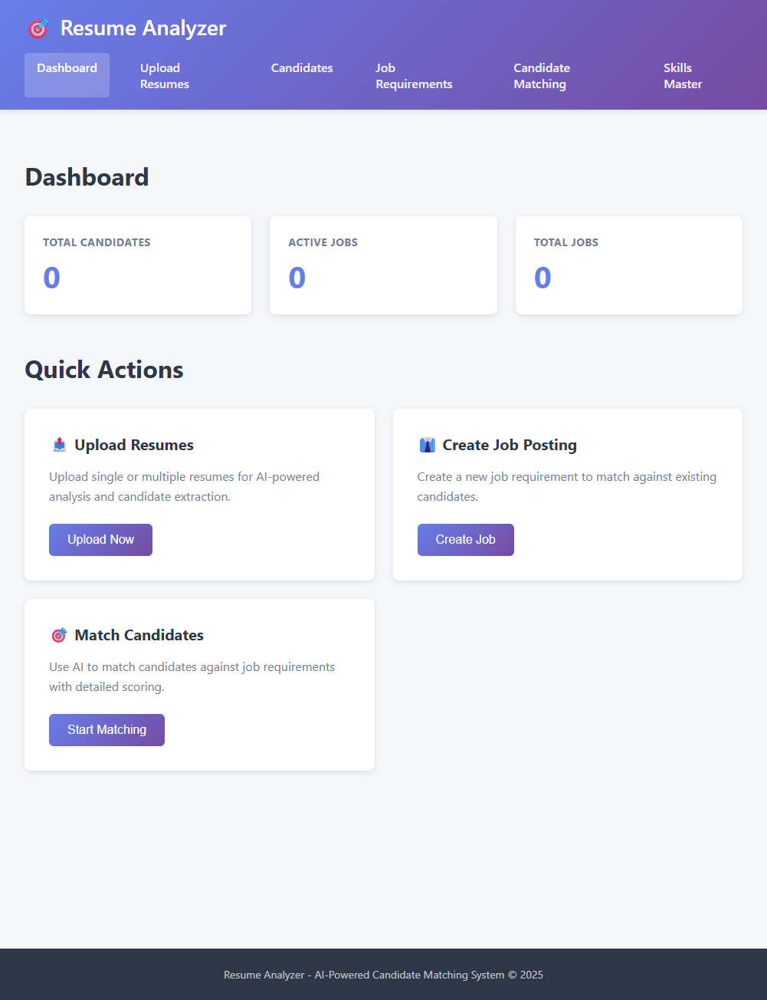
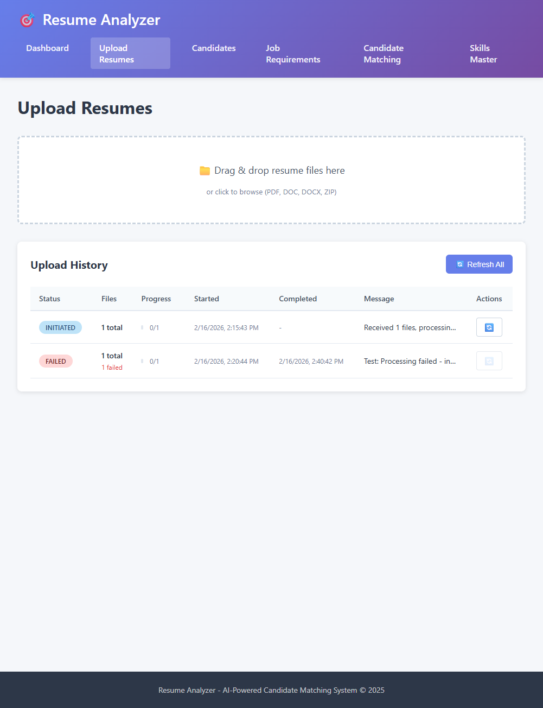
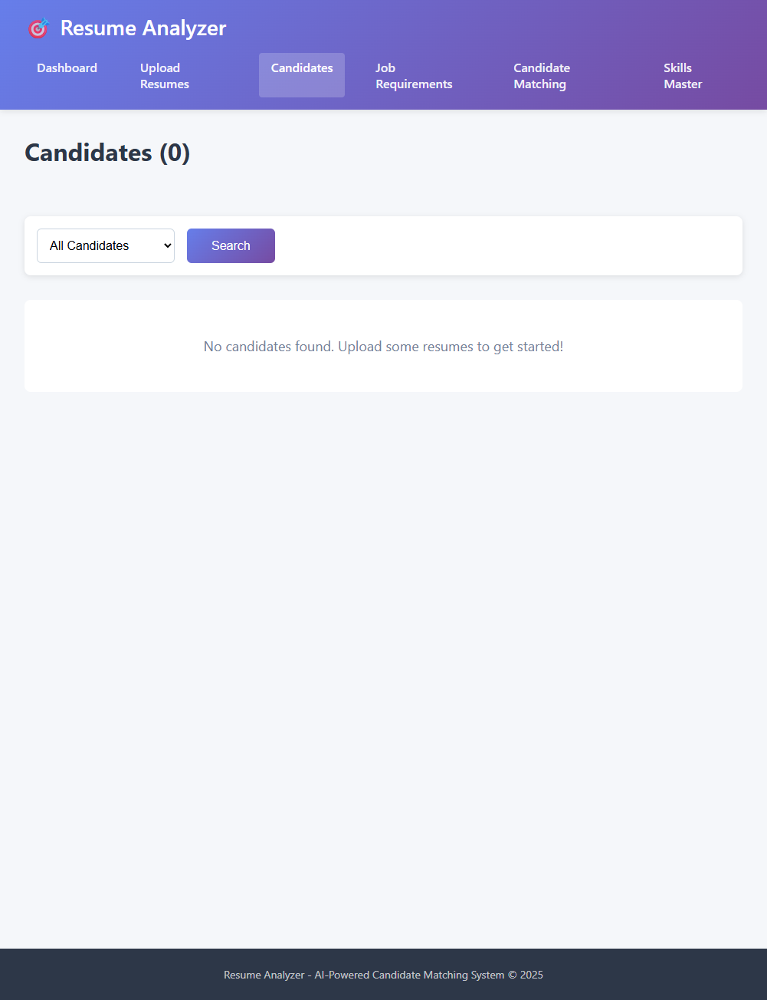
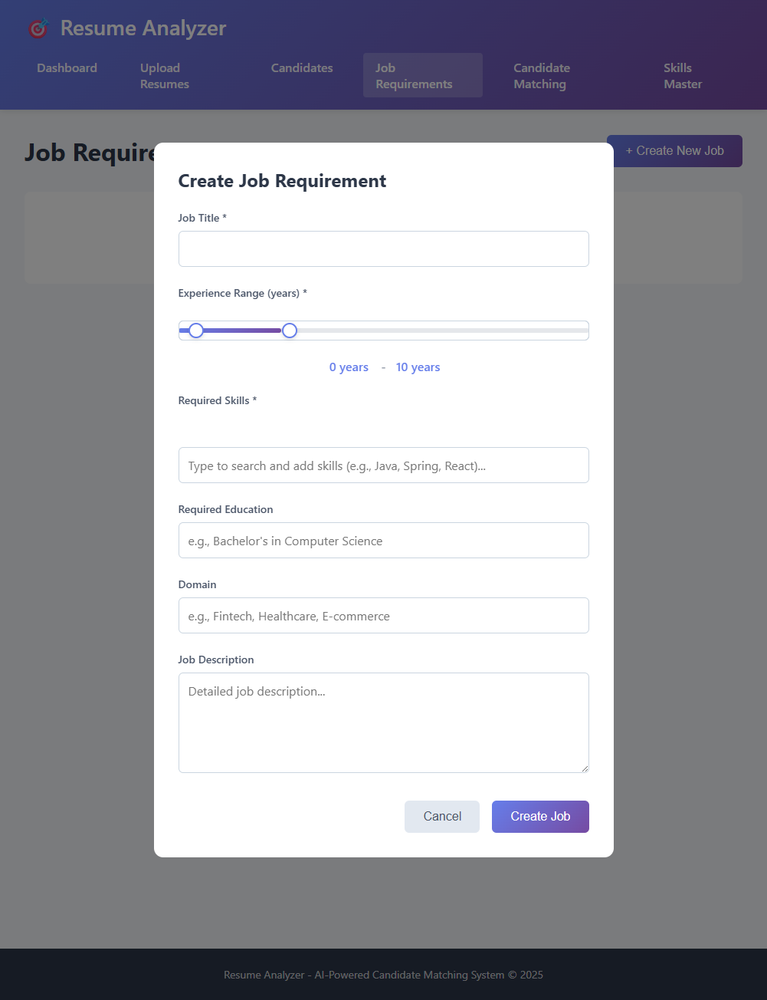
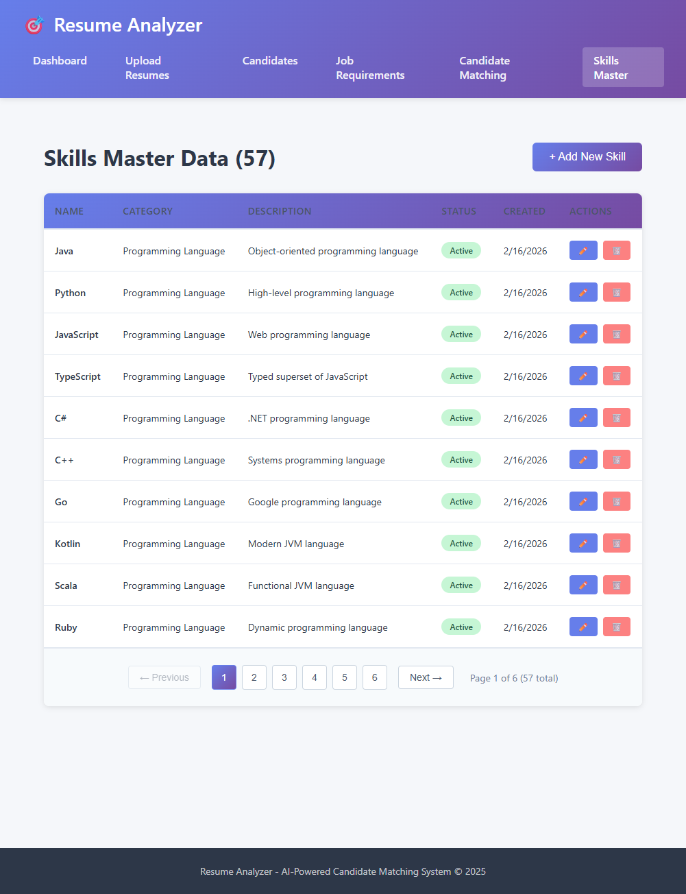
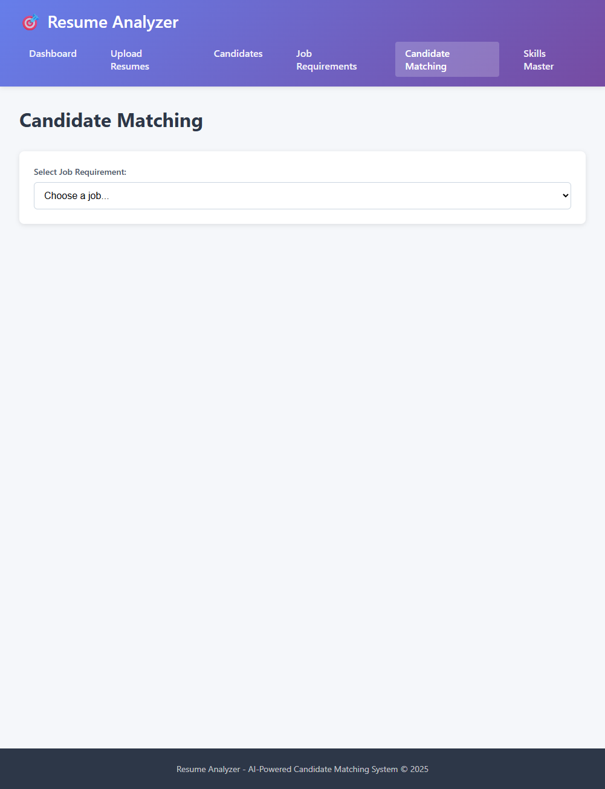

# Resume Analyzer - Development Guide

## Project Overview

Resume Analyzer is an AI-powered application that analyzes resumes, extracts candidate information, and matches candidates to job requirements using local LLM (Large Language Model) capabilities.

## Screenshots

### Dashboard
The main dashboard provides an overview of system statistics and quick access to key features.



### Resume Upload & Tracking
Upload resumes with real-time progress tracking and view upload history.



### Candidates List
Browse and manage all uploaded candidate profiles.



### Job Requirements
Create and manage job requirements with skills auto-complete and experience range selection.



### Skills Master
Centralized skills management system for maintaining standardized skill names.



### Candidate Matching
AI-powered candidate matching against job requirements.



## Architecture

### Backend Stack
- **Framework**: Java 25 + Spring Boot 3.2.2
- **Database**: PostgreSQL with pgvector extension
- **AI Integration**: Spring AI with local LLM Studio (localhost:1234)
- **API**: GraphQL for queries/mutations, REST for file uploads
- **Package Structure**: `io.subbu.ai.firedrill`

### Frontend Stack
- **Framework**: React 18 + TypeScript
- **State Management**: Redux Toolkit + Redux-Saga
- **Build Tool**: Vite
- **Styling**: CSS Modules
- **API Client**: GraphQL Request + Axios

## Project Structure

```
resume-analyzer/
├── src/main/
│   ├── java/io/subbu/ai/firedrill/
│   │   ├── entities/          # JPA entities
│   │   ├── repos/             # Spring Data repositories
│   │   ├── services/          # Business logic
│   │   ├── resolver/          # GraphQL resolvers
│   │   └── controller/        # REST controllers
│   ├── resources/
│   │   ├── application.yml    # Spring configuration
│   │   └── graphql/
│   │       └── schema.graphqls
│   └── frontend/
│       ├── src/
│       │   ├── components/    # Reusable React components
│       │   ├── pages/         # Page components
│       │   ├── store/         # Redux store & slices
│       │   └── services/      # API & GraphQL clients
│       └── package.json
└── pom.xml
```

## Setup Instructions

### Prerequisites
- Java 25
- Node.js 20.11.0+
- Yarn 1.22.19+
- PostgreSQL 15+
- LM Studio (for local LLM)

### Database Setup

1. Install PostgreSQL and pgvector:
```sql
CREATE DATABASE resume_analyzer;
\c resume_analyzer;
CREATE EXTENSION vector;
```

2. Update `application.yml` with your database credentials.

### LLM Studio Setup

1. Download and install [LM Studio](https://lmstudio.ai/)
2. Download recommended models:
   - **Primary Model**: Mistral 7B Instruct v0.3 or LLaMA 3.1 8B Instruct
   - **Embedding Model**: nomic-embed-text (768 dimensions)
3. Start LM Studio local server on `http://localhost:1234`

See [LLM-STUDIO-SETUP.md](LLM-STUDIO-SETUP.md) for detailed model recommendations.

### Backend Setup

```bash
# Build the project
mvn clean install

# Run Spring Boot application
mvn spring-boot:run
```

The backend will start on `http://localhost:8080`

- GraphQL Playground: http://localhost:8080/graphiql
- File Upload API: http://localhost:8080/api/upload/resume

### SPA Routing (Direct URL Navigation)

This app uses client-side routing via `BrowserRouter`. In production, the backend must forward unknown routes to `index.html` so direct links like `/jobs` work. This project includes a Spring MVC forwarder to enable that behavior.

### Frontend Setup

```bash
cd src/main/frontend
yarn install
yarn dev
```

The frontend will start on `http://localhost:3000`

## Development Workflow

### Adding New Features

1. **Backend**:
   - Create/update entities in `entities/`
   - Add repository methods in `repos/`
   - Implement business logic in `services/`
   - Create GraphQL resolvers in `resolver/`
   - Update `schema.graphqls` if needed

2. **Frontend**:
   - Add Redux slice in `store/slices/`
   - Create saga handlers in `store/sagas/`
   - Build UI components in `components/` or `pages/`
   - Add GraphQL queries/mutations in `services/graphql.ts`

### Running Tests

```bash
# Backend tests
mvn test

# Frontend tests
cd src/main/frontend
yarn test
```

## Features

### Skills Master Management
- **Admin Interface**: Manage skills master data with editable table UI
- **CRUD Operations**: Create, read, update, and delete skills
- **Auto-Suggestion**: Skills input with real-time search and suggestions
- **Badge Display**: Selected skills shown as removable badges
- **Categories**: Organize skills by category (Languages, Frameworks, Databases, etc.)
- **Pre-populated Data**: 70+ skills across multiple technology categories

### Resume Upload & Processing
- **Multi-format Support**: Upload resumes in PDF, DOC, DOCX, or ZIP formats
- **Batch Processing**: Process multiple resumes simultaneously
- **Real-time Tracking**: Track upload progress with detailed status updates
- **Upload History**: View recent uploads with status, progress, and timestamps
- **AI-powered Extraction**: Automatic information extraction using local LLM
- **Vector Embeddings**: Generate semantic embeddings for similarity search
- **Progress Monitoring**: Individual refresh buttons for each upload
- **Dual-component UI**: Separate upload area and progress tracking table

### Candidate Matching
- Match candidates to job requirements
- AI-powered scoring (skills, experience, education, domain)
- Shortlist and selection management
- Match explanations

## API Documentation

### GraphQL API

**📚 Complete API Documentation**: See [docs/GRAPHQL-API.md](docs/GRAPHQL-API.md) for comprehensive request/response examples, error handling, and best practices.

**Quick Reference:**

**Candidate Queries:**
- `allCandidates`: Get all candidates
- `searchCandidatesByName(name: String!)`: Search candidates by name
- `searchCandidatesBySkill(skill: String!)`: Search candidates by skill
- `candidatesByExperienceRange(minYears: Int!, maxYears: Int!)`: Filter by experience

**Job Requirement Queries:**
- `allJobRequirements`: Get all job requirements
- `activeJobRequirements`: Get active job postings only
- `searchJobsByTitle(title: String!)`: Search jobs by title

**Skills Queries:**
- `allSkills`: Get all skills with metadata
- `activeSkills`: Get only active skills
- `searchSkills(name: String!)`: Search skills by name (auto-suggestion)
- `skillsByCategory(category: String!)`: Filter skills by category
- `skillCategories`: Get list of all skill categories

**Matching Queries:**
- `matchesForJob(jobRequirementId: UUID!)`: Get all matches for a job
- `topMatchesForJob(jobRequirementId: UUID!, limit: Int, minScore: Float)`: Get top matches
- `matchesForCandidate(candidateId: UUID!)`: Get matches for a candidate
- `selectedCandidatesForJob(jobRequirementId: UUID!)`: Get selected candidates
- `shortlistedCandidatesForJob(jobRequirementId: UUID!)`: Get shortlisted candidates

**Process Tracker Queries:**
- `processStatus(trackerId: UUID!)`: Get upload process status
- `recentProcessTrackers(hours: Int!)`: Get recent upload processes

**Job Requirement Mutations:**
- `createJobRequirement(title: String!, description: String, requiredSkills: String, skillIds: [UUID!], ...)`: Create new job posting
- `updateJobRequirement(id: UUID!, title: String, description: String, skillIds: [UUID!], ...)`: Update job posting
- `deactivateJobRequirement(id: UUID!)`: Deactivate job posting
- `deleteJobRequirement(id: UUID!)`: Delete job posting

**Skills Mutations:**
- `createSkill(name: String!, category: String, description: String)`: Create new skill
- `updateSkill(id: UUID!, name: String, category: String, description: String, isActive: Boolean)`: Update skill
- `deleteSkill(id: UUID!)`: Delete skill

**Matching Mutations:**
- `matchCandidateToJob(candidateId: UUID!, jobRequirementId: UUID!)`: Match one candidate to a job
- `matchAllCandidatesToJob(jobRequirementId: UUID!)`: Match all candidates to a job
- `matchCandidateToAllJobs(candidateId: UUID!)`: Match candidate to all jobs
- `updateCandidateMatch(matchId: UUID!, input: UpdateCandidateMatchInput!)`: Update match status

**Candidate Mutations:**
- `deleteCandidate(id: UUID!)`: Delete candidate

### REST API

**File Upload:**
```
POST /api/upload/resume
Content-Type: multipart/form-data
Body: files (PDF, DOC, DOCX, ZIP)

Response: { trackerId: string, message: string }
```

**Process Status:**
```
GET /api/upload/status/{trackerId}

Response: {
  id: string,
  status: string,
  totalFiles: number,
  processedFiles: number,
  failedFiles: number
}
```

## Configuration

### Environment Variables

Create `.env` file based on `.env.example`:

```properties
# Database
POSTGRES_HOST=localhost
POSTGRES_PORT=5432
POSTGRES_DB=resume_analyzer
POSTGRES_USER=postgres
POSTGRES_PASSWORD=your_password

# LLM Studio
LLM_STUDIO_BASE_URL=http://localhost:1234/v1
LLM_STUDIO_MODEL=mistral-7b-instruct-v0.3
LLM_STUDIO_EMBEDDING_MODEL=nomic-embed-text

# Application
SERVER_PORT=8080
```

### Spring AI Configuration

The application uses Spring AI's OpenAI-compatible client configured for LLM Studio:

```yaml
spring:
  ai:
    openai:
      base-url: ${LLM_STUDIO_BASE_URL}
      api-key: ${LLM_STUDIO_API_KEY:not-needed}
      chat:
        options:
          model: ${LLM_STUDIO_MODEL}
          temperature: 0.7
          max-tokens: 2000
      embedding:
        options:
          model: ${LLM_STUDIO_EMBEDDING_MODEL}
```

## Building for Production

```bash
# Full build (backend + frontend)
mvn clean package

# This creates a single JAR with embedded frontend
# Output: target/resume-analyzer-1.0.0.jar

# Run the JAR
java -jar target/resume-analyzer-1.0.0.jar
```

The Maven build:
1. Installs Node.js and Yarn
2. Builds the React frontend
3. Copies frontend assets to `static/`
4. Packages everything into a single executable JAR

## Troubleshooting

### Common Issues

1. **LLM Studio Connection Failed**
   - Ensure LM Studio is running on localhost:1234
   - Check model is loaded in LM Studio
   - Verify base URL in configuration

2. **pgvector Extension Missing**
   ```sql
   CREATE EXTENSION vector;
   ```

3. **Frontend API Calls Failing**
   - Check proxy configuration in `vite.config.ts`
   - Ensure backend is running on port 8080

4. **Build Failures**
   - Clear Maven cache: `mvn clean`
   - Delete `node_modules` and reinstall: `rm -rf src/main/frontend/node_modules && cd src/main/frontend && yarn install`

## Performance Tips

1. **Embedding Generation**: Process resumes in batches (default: 10 per batch)
2. **Database**: Add indexes on frequently queried fields
3. **Frontend**: Use pagination for large candidate/match lists
4. **LLM**: Adjust temperature and max_tokens based on response quality needs

## Documentation

Comprehensive documentation is available in the `docs/` folder:

- **[ARCHITECTURE.md](docs/ARCHITECTURE.md)** - System architecture with 15+ UML diagrams
- **[GRAPHQL-API.md](docs/GRAPHQL-API.md)** - Complete GraphQL API reference with examples
- **[NEXT-STEPS.md](docs/NEXT-STEPS.md)** - Complete roadmap with 7 implementation phases
- **[PROJECT-SUMMARY.md](docs/PROJECT-SUMMARY.md)** - Complete feature overview
- **[LLM-STUDIO-SETUP.md](docs/LLM-STUDIO-SETUP.md)** - LM Studio configuration guide
- **[DOCKER-DEPLOYMENT.md](docs/DOCKER-DEPLOYMENT.md)** - Docker deployment guide
- **[SKILLS-MANAGEMENT.md](docs/SKILLS-MANAGEMENT.md)** - Skills master data management
- **[.env.example](docs/.env.example)** - Environment variables template
- **[resume-analyzer.md](docs/resume-analyzer.md)** - Original requirements

## Contributing

1. Follow the package structure convention
2. Write unit tests for new services
3. Update GraphQL schema when adding new types
4. Use TypeScript strict mode for frontend code
5. Follow REST API naming conventions for new endpoints

## License

This project is licensed under the MIT License - see the [LICENSE](LICENSE) file for details.
