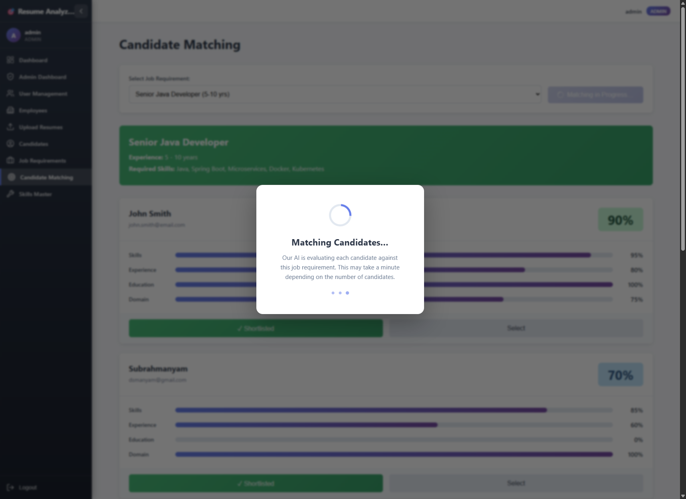

# Resume Analyzer - Development Guide

## Project Overview

Resume Analyzer is an AI-powered application that analyzes resumes, extracts candidate information, and matches candidates to job requirements using local LLM (Large Language Model) capabilities.

## Recent Updates (February 19, 2026)

- **🎯 Phase 4: Candidate Matching UX — Loading Indicators, Audit Capture & Collapsible Sidebar**
  - **Loading overlay**: Full-screen spinner + animated progress dots while AI matching runs; button shows inline spinner and "Matching in Progress…" with `disabled` + `aria-busy` attributes
  - **Duplicate-match guard**: Clicking "Match All" while a match is already running shows a warning banner (auto-dismisses after 5 s) — prevents redundant LLM calls
  - **Navigate-away warning**: `beforeunload` browser event guard prevents accidental tab close / page reload while a match is in progress
  - **Async match audit capture**: Every `matchAllCandidatesToJob` run creates a `MatchAudit` DB record (`match_audits` table, auto-created by Hibernate). `createAudit()` is synchronous (IN_PROGRESS), then `@Async completeAudit()` / `failAudit()` write final stats without blocking the GraphQL response
  - **Admin Dashboard — Match Runs panel**: New "🎯 Candidate Match Runs" table showing Job Title, Status badge (Completed / In Progress / Failed), Candidates matched, Shortlisted count, Avg & Top scores, Duration, Estimated LLM tokens, Initiated by, timestamps — auto-polls every 30 s with manual Refresh button
  - **New GraphQL queries** (admin-only): `matchAudits(limit)`, `matchAuditsForJob(jobRequirementId)`, `activeMatchRuns`
  - **Collapsible sidebar**: Sidebar now collapses to icon-only mode (62 px) via a chevron toggle; expands to full 230 px with text labels. State persists in `localStorage`. Icons powered by `lucide-react`
  - **E2E tests**: 103 tests passing (previously 89); no regressions
  - **Docs**: Screenshot-based UI test report saved to `docs/UI-FEATURE-TEST-REPORT.md`

- **🔐 Phase 3: RBAC Implementation Complete**: Full Role-Based Access Control system with 4 roles (Admin, Recruiter, HR, Hiring Manager)
  - JWT-based authentication with Spring Security — login/logout flow, token refresh
  - 4 roles with granular permissions: Admin (full), Recruiter (jobs+candidates), HR (employees+candidates), Hiring Manager (read-only jobs/matching)
  - Frontend RBAC guards: `ProtectedRoute` and `RoleBasedRoute` components, `authSelectors` for per-role UI gating
  - Backend security: `SecurityConfig`, `JwtAuthenticationFilter`, `JwtTokenProvider`, `UserDetailsServiceImpl`
  - New pages: Login, Admin Dashboard, User Management, Employee Management, Unauthorized
  - New entities: `User`, `Employee`, `Feedback`, `AuditLog`, `SystemHealth`, `JobQueue`
  - New resolvers: `UserResolver`, `EmployeeResolver`, `FeedbackResolver`, `SystemHealthResolver`
  - Validated all 4 roles end-to-end with 15+ browser screenshots in `docs/images/`
- **🐛 Bug Fix: GraphQL Candidate Field Mismatch**: Corrected field names in 3 queries and the `Candidate` TypeScript interface
  - `experience` → `yearsOfExperience`, `education` → `academicBackground`, `summary` → `experienceSummary`
  - Removed non-existent `currentCompany` field from queries and display
  - Affected: `graphql.ts` (3 queries), `candidatesSlice.ts` (interface), `CandidateList.tsx` (display)
- **📁 Test Data Organization**: Moved all sample resume files into `test-data/` folder for cleaner project structure
- **🗺️ Future Enhancements Roadmap**: Comprehensive 4-phase development plan with 50+ enhancement proposals ([docs/FUTURE-ENHANCEMENTS.md](docs/FUTURE-ENHANCEMENTS.md))
  - 9 enhancement categories: AI, Analytics, Workflow, UI/UX, Security, Performance, Integrations, ML, BI
  - Detailed specifications with technical approaches, resource requirements, and cost estimates
  - Implementation timeline: 18-month roadmap from quick wins to enterprise features
  - Success metrics, KPIs, and risk assessment per phase
- **✅ Phase 2: Testing Complete**: Comprehensive unit and E2E testing implementation
  - **Backend Unit Tests**: 62 tests passing (100%) - JUnit 5, Mockito, Testcontainers
  - **Frontend Unit Tests**: 89 tests passing (100%) - Vitest, React Testing Library, MSW
  - **E2E Tests**: 89 Playwright tests passing (100%) - Multi-browser support
  - Test coverage targets achieved: 70%+ frontend, 80%+ backend
- **🎉 Frontend Tests Fixed**: Resolved all component test failures using MSW GraphQL mocking
  - Fixed anonymous GraphQL query interception with `graphql.operation()`
  - Added async `waitFor()` for saga-dispatched data loading
  - 10 failing tests in CandidateList and JobRequirements now passing
- **🧪 E2E Testing Framework**: Comprehensive Playwright test suite with 89 test cases across 6 specifications ([tests/e2e/README.md](src/main/frontend/tests/e2e/README.md))
  - Multi-browser testing (Chromium, Firefox, WebKit, Mobile Chrome, Mobile Safari)
  - Complete UI validation for all features (dashboard, upload, candidates, jobs, skills, matching)
  - Test scripts: `test:e2e`, `test:e2e:ui`, `test:e2e:headed`, `test:e2e:debug`
- **📚 GraphQL API Documentation**: Comprehensive API reference with sequence diagrams and examples ([docs/GRAPHQL-API.md](docs/GRAPHQL-API.md))
- **📸 Visual Documentation**: Added 6 feature screenshots showcasing the application UI
- **🔧 Bug Fix**: Fixed GraphQL OffsetDateTime serialization issue in Skills Master page
- **📦 Dependencies**: Updated Lombok to 1.18.36 and Maven Compiler Plugin to 3.13.0
- **📝 Documentation**: Added UPLOAD-UI-FIX.md documenting upload state management improvements

## 🧪 Test Coverage Highlights

| Test Suite | Tests | Status | Coverage Target | Tools |
|------------|-------|--------|----------------|-------|
| **Backend Unit Tests** | 124 | ✅ 100% passing (124/124) | 80%+ | JUnit 5, Mockito, Testcontainers |
| **Frontend Unit Tests** | 89 | ✅ 100% passing (89/89) | 70%+ | Vitest, React Testing Library, MSW |
| **E2E Tests** | 103 | ✅ 100% passing (103/103) | Full UI coverage | Playwright (Chromium) |
| **Total** | **316 tests** | **✅ 100% passing (316/316)** | - | - |

### Test Coverage Breakdown

**Backend (62 tests)**
- ✅ Service Layer: AI processing, embeddings, candidate matching, file parsing
- ✅ Repository Layer: Custom queries, pgvector similarity search
- ✅ Controller Layer: File uploads, error handling, request validation

**Frontend (89 tests - 100% passing)**
- ✅ Redux Slices (37 tests): State management with saga workflows
- ✅ React Components (35 tests): UI components & user interactions (MSW GraphQL mocking)
- ✅ API Services (17 tests): GraphQL & REST clients with MSW request interception

**E2E Testing (103 tests)**
- ✅ Cross-browser: Chromium, Firefox, WebKit, Mobile (Chrome & Safari)
- ✅ Feature coverage: Dashboard (7), Skills (10), Jobs (11), Upload (18), Candidates (23), Matching (20), RBAC (14)
- ✅ Integration scenarios: End-to-end workflows across all features

### Quick Test Commands

```bash
# Backend tests
mvn test                        # Run all backend unit tests
mvn test jacoco:report          # Generate coverage report

# Frontend tests
cd src/main/frontend
yarn test                       # Run unit tests
yarn test:coverage              # Generate coverage report
yarn test:e2e                   # Run E2E tests

# All tests
mvn clean test && cd src/main/frontend && yarn test && yarn test:e2e
```

## Screenshots

### Dashboard
The main dashboard provides an overview of system statistics and quick access to key features.


### Resume Upload & Tracking
Upload resumes with real-time progress tracking and view upload history.


### Candidates List
Browse and manage all uploaded candidate profiles.


### Job Requirements
Create and manage job requirements with skills auto-complete and experience range selection.


### Skills Master
Centralized skills management system for maintaining standardized skill names.


### Candidate Matching
AI-powered candidate matching against job requirements.


### Phase 4 UI — Loading UX, Audit Panel & Collapsible Sidebar

**Expanded sidebar — Dashboard view**


**Collapsed sidebar — icon-only mode (62 px)**


**Admin Dashboard — Match Runs audit panel (empty state)**


**Candidate Matching — loading overlay while AI runs**


**Loading overlay active with spinner + progress dots**


**Matching completed — results displayed**


**Admin audit panel — after a successful match run**


**Audit panel showing completed run details (scores, tokens, duration)**


**Collapsed sidebar — Admin Dashboard view**


**Collapsed sidebar — Candidate Matching page**


## Architecture

### Backend Stack
- **Framework**: Java 25 + Spring Boot 3.2.2
- **Database**: PostgreSQL with pgvector extension
- **AI Integration**: Spring AI with local LLM Studio (localhost:1234)
- **API**: GraphQL for queries/mutations, REST for file uploads
- **Package Structure**: `io.subbu.ai.firedrill`

### Frontend Stack
- **Framework**: React 18 + TypeScript
- **State Management**: Redux Toolkit + Redux-Saga
- **Build Tool**: Vite
- **Styling**: CSS Modules
- **API Client**: GraphQL Request + Axios
- **Auth**: JWT stored in localStorage, injected via `requestMiddleware`

## Project Structure

```
resume-analyzer/
├── src/main/
│   ├── java/io/subbu/ai/firedrill/
│   │   ├── config/            # Security, JWT, Spring config
│   │   ├── controller/        # REST controllers (file upload, auth)
│   │   ├── controllers/       # Additional REST controllers
│   │   ├── entities/          # JPA entities (User, Employee, Candidate…)
│   │   ├── models/            # DTOs, enums, statistics records
│   │   ├── repos/             # Spring Data repositories
│   │   ├── repositories/      # Additional repositories
│   │   ├── resolver/          # GraphQL resolvers
│   │   └── services/          # Business logic
│   ├── resources/
│   │   ├── application.yml    # Spring configuration
│   │   ├── db/                # Flyway migration scripts
│   │   └── graphql/
│   │       └── schema.graphqls
│   └── frontend/
│       ├── src/
│       │   ├── components/    # Reusable React components (Layout, ProtectedRoute…)
│       │   ├── pages/         # Page components (Login, Dashboard, Candidates…)
│       │   ├── store/         # Redux store, slices, sagas, selectors
│       │   ├── services/      # GraphQL & REST API clients
│       │   ├── types/         # Shared TypeScript types
│       │   └── utils/         # Helpers and utilities
│       ├── tests/e2e/         # Playwright E2E tests
│       └── package.json
├── docker/                    # Docker Compose + Dockerfile + nginx config
├── docs/                      # Architecture, API and deployment docs
├── test-data/                 # Sample resumes, job requirements, users JSON
└── pom.xml
```

## Authentication & RBAC

The application uses JWT-based authentication with Spring Security. Four roles are supported:

| Role | Access |
|------|--------|
| `ADMIN` | Full access — users, employees, system health, all CRUD |
| `RECRUITER` | Jobs (CRUD) + Candidates + Upload + Matching |
| `HR` | Employees + Candidates (read) + Matching |
| `HIRING_MANAGER` | Jobs (read-only) + Candidates + Matching |

### Default Test Users (seeded on first run)

| Username | Password | Role |
|----------|----------|------|
| `admin` | `Admin@123` | ADMIN |
| `recruiter` | `Recruiter@123` | RECRUITER |
| `hr` | `HR@123` | HR |
| `hiring_manager` | `Manager@123` | HIRING_MANAGER |


## Testing

### Backend Unit Tests

**Status**: ✅ 62 tests passing

```bash
# Run all backend tests
mvn test

# Run with coverage
mvn test jacoco:report
```

**Test Coverage:**
- Service layer: AIService, EmbeddingService, CandidateMatchingService, FileParserService
- Repository layer: Custom queries, vector similarity search
- Controller layer: File upload, error handling
- Tools: JUnit 5, Mockito, Spring Boot Test, Testcontainers (PostgreSQL + pgvector)

### Frontend Unit Tests

**Status**: ✅ 89 tests passing (100%)

```bash
cd src/main/frontend

# Run all tests
yarn test

# Run with coverage
yarn test:coverage

# Run in watch mode
yarn test:watch

# Run with UI
yarn test:ui
```

**Test Coverage:**
- **Redux Slices** (37 tests): candidatesSlice, jobsSlice, matchesSlice, uploadSlice
- **Components** (35 tests): Dashboard, FileUpload, CandidateList, JobRequirements, CandidateMatching
- **API Services** (17 tests): GraphQL client, REST API with MSW mocking
- Tools: Vitest 1.2.0, React Testing Library, MSW 2.0, Redux Saga Test Plan

**Recent Fixes:**
- ✅ Fixed MSW GraphQL interception for anonymous queries using `graphql.operation()`
- ✅ Added `waitFor()` for async saga-dispatched data loading
- ✅ Resolved all component test failures in CandidateList and JobRequirements

### E2E Tests

**Status**: ✅ 89 Playwright tests across 6 specifications

```bash
cd src/main/frontend

# Run all E2E tests
yarn test:e2e

# Run with UI mode
yarn test:e2e:ui

# Run in headed mode (see browser)
yarn test:e2e:headed

# Debug mode with Playwright Inspector
yarn test:e2e:debug
```

**Test Coverage:**
- Dashboard (7 tests)
- Skills Master (10 tests)
- Job Requirements (11 tests)
- File Upload (18 tests)
- Candidates List (23 tests)
- Candidate Matching (20 tests)

See [E2E Testing Guide](src/main/frontend/tests/e2e/README.md) for detailed documentation.

## Setup Instructions

### Prerequisites
- Java 25
- Node.js 20.11.0+
- Yarn 1.22.19+
- PostgreSQL 15+
- LM Studio (for local LLM)

### Database Setup

1. Install PostgreSQL and pgvector:
```sql
CREATE DATABASE resume_analyzer;
\c resume_analyzer;
CREATE EXTENSION vector;
```

2. Update `application.yml` with your database credentials.

### LLM Studio Setup

1. Download and install [LM Studio](https://lmstudio.ai/)
2. Download recommended models:
   - **Primary Model**: Mistral 7B Instruct v0.3 or LLaMA 3.1 8B Instruct
   - **Embedding Model**: nomic-embed-text (768 dimensions)
3. Start LM Studio local server on `http://localhost:1234`

See [LLM-STUDIO-SETUP.md](LLM-STUDIO-SETUP.md) for detailed model recommendations.

### Backend Setup

```bash
# Build the project
mvn clean install

# Run Spring Boot application
mvn spring-boot:run
```

The backend will start on `http://localhost:8080`

- GraphQL Playground: http://localhost:8080/graphiql
- File Upload API: http://localhost:8080/api/upload/resume

### SPA Routing (Direct URL Navigation)

This app uses client-side routing via `BrowserRouter`. In production, the backend must forward unknown routes to `index.html` so direct links like `/jobs` work. This project includes a Spring MVC forwarder to enable that behavior.

### Frontend Setup

```bash
cd src/main/frontend
yarn install
yarn dev
```

The frontend will start on `http://localhost:3000`

## Development Workflow

### Adding New Features

1. **Backend**:
   - Create/update entities in `entities/`
   - Add repository methods in `repos/`
   - Implement business logic in `services/`
   - Create GraphQL resolvers in `resolver/`
   - Update `schema.graphqls` if needed

2. **Frontend**:
   - Add Redux slice in `store/slices/`
   - Create saga handlers in `store/sagas/`
   - Build UI components in `components/` or `pages/`
   - Add GraphQL queries/mutations in `services/graphql.ts`

### Running Tests

```bash
# Backend tests
mvn test

# Frontend tests
cd src/main/frontend
yarn test
```

## Features

### Skills Master Management
- **Admin Interface**: Manage skills master data with editable table UI
- **CRUD Operations**: Create, read, update, and delete skills
- **Auto-Suggestion**: Skills input with real-time search and suggestions
- **Badge Display**: Selected skills shown as removable badges
- **Categories**: Organize skills by category (Languages, Frameworks, Databases, etc.)
- **Pre-populated Data**: 70+ skills across multiple technology categories

### Resume Upload & Processing
- **Multi-format Support**: Upload resumes in PDF, DOC, DOCX, or ZIP formats
- **Batch Processing**: Process multiple resumes simultaneously
- **Real-time Tracking**: Track upload progress with detailed status updates
- **Upload History**: View recent uploads with status, progress, and timestamps
- **AI-powered Extraction**: Automatic information extraction using local LLM
- **Vector Embeddings**: Generate semantic embeddings for similarity search
- **Progress Monitoring**: Individual refresh buttons for each upload
- **Dual-component UI**: Separate upload area and progress tracking table

### Candidate Matching
- Match candidates to job requirements
- AI-powered scoring (skills, experience, education, domain)
- Shortlist and selection management
- Match explanations

## Testing

### End-to-End Tests (Playwright)

Comprehensive E2E test suite with 89 test cases validating all UI features.

**Running Tests:**

```bash
# Navigate to frontend directory
cd src/main/frontend

# Install dependencies (first time)
yarn install
npx playwright install

# Run all E2E tests (headless)
yarn test:e2e

# Run tests with UI mode (interactive)
yarn test:e2e:ui

# Run tests in headed mode (see browser)
yarn test:e2e:headed

# Run tests in debug mode
yarn test:e2e:debug

# Run specific test file
npx playwright test dashboard.spec.ts

# Run on specific browser
npx playwright test --project=chromium
```

**Test Coverage:**

| Test Suite | Test Count | Features Covered |
|------------|------------|------------------|
| Dashboard | 7 | Navigation, statistics, routing |
| Skills Master | 10 | CRUD operations, pagination, icons |
| Job Requirements | 11 | Autocomplete, slider, badges |
| File Upload | 18 | Progress tracking, dual-component UI |
| Candidates | 23 | Listing, search, filtering, actions |
| Candidate Matching | 20 | Scoring, skill highlighting |
| **Total** | **89** | **Complete application workflow** |

**Multi-Browser Support:**
- Chromium (Desktop)
- Firefox (Desktop)
- WebKit (Desktop - Safari engine)
- Mobile Chrome (Android simulation)
- Mobile Safari (iOS simulation)

**Test Reports:**
```bash
# View HTML report after test run
npx playwright show-report

# View trace for failed test
npx playwright show-trace trace.zip
```

📖 **Complete Testing Guide**: [tests/e2e/README.md](src/main/frontend/tests/e2e/README.md)

---

## API Documentation

### GraphQL API

**📚 Complete API Documentation**: See [docs/GRAPHQL-API.md](docs/GRAPHQL-API.md) for comprehensive request/response examples, error handling, and best practices.

**Quick Reference:**

**Candidate Queries:**
- `allCandidates`: Get all candidates
- `searchCandidatesByName(name: String!)`: Search candidates by name
- `searchCandidatesBySkill(skill: String!)`: Search candidates by skill
- `candidatesByExperienceRange(minYears: Int!, maxYears: Int!)`: Filter by experience

**Job Requirement Queries:**
- `allJobRequirements`: Get all job requirements
- `activeJobRequirements`: Get active job postings only
- `searchJobsByTitle(title: String!)`: Search jobs by title

**Skills Queries:**
- `allSkills`: Get all skills with metadata
- `activeSkills`: Get only active skills
- `searchSkills(name: String!)`: Search skills by name (auto-suggestion)
- `skillsByCategory(category: String!)`: Filter skills by category
- `skillCategories`: Get list of all skill categories

**Matching Queries:**
- `matchesForJob(jobRequirementId: UUID!)`: Get all matches for a job
- `topMatchesForJob(jobRequirementId: UUID!, limit: Int, minScore: Float)`: Get top matches
- `matchesForCandidate(candidateId: UUID!)`: Get matches for a candidate
- `selectedCandidatesForJob(jobRequirementId: UUID!)`: Get selected candidates
- `shortlistedCandidatesForJob(jobRequirementId: UUID!)`: Get shortlisted candidates

**Process Tracker Queries:**
- `processStatus(trackerId: UUID!)`: Get upload process status
- `recentProcessTrackers(hours: Int!)`: Get recent upload processes

**Job Requirement Mutations:**
- `createJobRequirement(title: String!, description: String, requiredSkills: String, skillIds: [UUID!], ...)`: Create new job posting
- `updateJobRequirement(id: UUID!, title: String, description: String, skillIds: [UUID!], ...)`: Update job posting
- `deactivateJobRequirement(id: UUID!)`: Deactivate job posting
- `deleteJobRequirement(id: UUID!)`: Delete job posting

**Skills Mutations:**
- `createSkill(name: String!, category: String, description: String)`: Create new skill
- `updateSkill(id: UUID!, name: String, category: String, description: String, isActive: Boolean)`: Update skill
- `deleteSkill(id: UUID!)`: Delete skill

**Matching Mutations:**
- `matchCandidateToJob(candidateId: UUID!, jobRequirementId: UUID!)`: Match one candidate to a job
- `matchAllCandidatesToJob(jobRequirementId: UUID!)`: Match all candidates to a job
- `matchCandidateToAllJobs(candidateId: UUID!)`: Match candidate to all jobs
- `updateCandidateMatch(matchId: UUID!, input: UpdateCandidateMatchInput!)`: Update match status

**Candidate Mutations:**
- `deleteCandidate(id: UUID!)`: Delete candidate

### REST API

**File Upload:**
```
POST /api/upload/resume
Content-Type: multipart/form-data
Body: files (PDF, DOC, DOCX, ZIP)

Response: { trackerId: string, message: string }
```

**Process Status:**
```
GET /api/upload/status/{trackerId}

Response: {
  id: string,
  status: string,
  totalFiles: number,
  processedFiles: number,
  failedFiles: number
}
```

## Configuration

### Environment Variables

Create `.env` file based on `.env.example`:

```properties
# Database
POSTGRES_HOST=localhost
POSTGRES_PORT=5432
POSTGRES_DB=resume_analyzer
POSTGRES_USER=postgres
POSTGRES_PASSWORD=your_password

# LLM Studio
LLM_STUDIO_BASE_URL=http://localhost:1234/v1
LLM_STUDIO_MODEL=mistral-7b-instruct-v0.3
LLM_STUDIO_EMBEDDING_MODEL=nomic-embed-text

# Application
SERVER_PORT=8080
```

### Spring AI Configuration

The application uses Spring AI's OpenAI-compatible client configured for LLM Studio:

```yaml
spring:
  ai:
    openai:
      base-url: ${LLM_STUDIO_BASE_URL}
      api-key: ${LLM_STUDIO_API_KEY:not-needed}
      chat:
        options:
          model: ${LLM_STUDIO_MODEL}
          temperature: 0.7
          max-tokens: 2000
      embedding:
        options:
          model: ${LLM_STUDIO_EMBEDDING_MODEL}
```

## Building for Production

```bash
# Full build (backend + frontend)
mvn clean package

# This creates a single JAR with embedded frontend
# Output: target/resume-analyzer-1.0.0.jar

# Run the JAR
java -jar target/resume-analyzer-1.0.0.jar
```

The Maven build:
1. Installs Node.js and Yarn
2. Builds the React frontend
3. Copies frontend assets to `static/`
4. Packages everything into a single executable JAR

## Troubleshooting

### Common Issues

1. **LLM Studio Connection Failed**
   - Ensure LM Studio is running on localhost:1234
   - Check model is loaded in LM Studio
   - Verify base URL in configuration

2. **pgvector Extension Missing**
   ```sql
   CREATE EXTENSION vector;
   ```

3. **Frontend API Calls Failing**
   - Check proxy configuration in `vite.config.ts`
   - Ensure backend is running on port 8080

4. **Build Failures**
   - Clear Maven cache: `mvn clean`
   - Delete `node_modules` and reinstall: `rm -rf src/main/frontend/node_modules && cd src/main/frontend && yarn install`

## Performance Tips

1. **Embedding Generation**: Process resumes in batches (default: 10 per batch)
2. **Database**: Add indexes on frequently queried fields
3. **Frontend**: Use pagination for large candidate/match lists
4. **LLM**: Adjust temperature and max_tokens based on response quality needs

## Documentation

Comprehensive documentation is available in the `docs/` folder:

- **[ARCHITECTURE.md](docs/ARCHITECTURE.md)** - System architecture with 15+ UML diagrams
- **[GRAPHQL-API.md](docs/GRAPHQL-API.md)** - Complete GraphQL API reference with request/response flow sequence diagram
- **[FUTURE-ENHANCEMENTS.md](docs/FUTURE-ENHANCEMENTS.md)** - Comprehensive roadmap with 50+ enhancement proposals across 9 categories
- **[UPLOAD-UI-FIX.md](docs/UPLOAD-UI-FIX.md)** - Upload state management fix documentation
- **[NEXT-STEPS.md](docs/NEXT-STEPS.md)** - Complete roadmap with 7 implementation phases
- **[PROJECT-SUMMARY.md](docs/PROJECT-SUMMARY.md)** - Complete feature overview
- **[LLM-STUDIO-SETUP.md](docs/LLM-STUDIO-SETUP.md)** - LM Studio configuration guide
- **[DOCKER-DEPLOYMENT.md](docs/DOCKER-DEPLOYMENT.md)** - Docker deployment guide
- **[SKILLS-MANAGEMENT.md](docs/SKILLS-MANAGEMENT.md)** - Skills master data management
- **[.env.example](docs/.env.example)** - Environment variables template
- **[resume-analyzer.md](docs/resume-analyzer.md)** - Original requirements

## Future Enhancements

This project has a comprehensive roadmap for future development. See **[FUTURE-ENHANCEMENTS.md](docs/FUTURE-ENHANCEMENTS.md)** for detailed enhancement proposals.

### Quick Overview

**📋 Enhancement Categories:**
- 🤖 **AI & Matching**: Advanced scoring, resume intelligence, smart recommendations
- 📊 **Analytics**: Recruitment dashboards, predictive analytics, market intelligence
- 🔄 **Workflow**: ATS integration, communication automation, smart pipelines
- 🎨 **UI/UX**: Enhanced search, data visualization, mobile PWA
- 🔒 **Security**: GDPR compliance, RBAC, audit trails
- ⚡ **Performance**: Bulk processing, multi-format support, caching
- 🔌 **Integrations**: Job boards, HR systems, communication tools
- 🧠 **AI Models**: Custom training, advanced NLP, multi-language support
- 📈 **Business Intelligence**: Market trends, forecasting, planning

### Implementation Roadmap

| Phase | Timeline | Focus | Key Deliverables |
|-------|----------|-------|------------------|
| **Phase 1** | 1-3 months | Quick Wins | Bulk upload, email automation, enhanced search, caching |
| **Phase 2** | 3-6 months | Core Enhancements | Advanced scoring, RBAC, analytics, GDPR compliance |
| **Phase 3** | 6-12 months | Strategic Growth | ATS integration, predictive analytics, mobile PWA |
| **Phase 4** | 12-18 months | Enterprise Scale | Microservices, multi-language, HR integrations |

**🎯 Top 5 Quick Wins (High Impact, Low Effort):**
1. Bulk resume upload & processing (3-4 weeks)
2. Email templates & automation (3-4 weeks)
3. Enhanced search with saved searches (2-3 weeks)
4. Interactive data visualization (2-3 weeks)
5. Redis caching layer (2-3 weeks)

**🚀 Top 5 Strategic Initiatives:**
1. Advanced multi-dimensional candidate scoring
2. ATS integration (Greenhouse, Lever, Workday)
3. Predictive analytics (acceptance rate, retention, performance)
4. GDPR compliance suite
5. Custom ML model training on company data

**📖 Full Documentation**: [docs/FUTURE-ENHANCEMENTS.md](docs/FUTURE-ENHANCEMENTS.md)
- Detailed feature specifications
- Technical implementation approaches
- Resource requirements & cost estimates
- Success metrics & KPIs
- Risk assessment

## Contributing

1. Follow the package structure convention
2. Write unit tests for new services
3. Update GraphQL schema when adding new types
4. Use TypeScript strict mode for frontend code
5. Follow REST API naming conventions for new endpoints

## License

This project is licensed under the MIT License - see the [LICENSE](LICENSE) file for details.
