# Agentic RAG — Candidate Enrichment & AI Matching

## Overview

Resume Analyzer uses an **Agentic Retrieval-Augmented Generation (RAG)** pipeline to enrich candidate profiles before AI-powered job matching. Rather than passing raw resume text to the LLM, the system autonomously decides *what* additional data to fetch, *when* to fetch it, and *how* to present it to the model — transforming a static one-shot match into a multi-step reasoning loop.

This document describes the architecture, data flow, configuration options, and extension points for the agentic pipeline.

---

## Table of Contents

1. [Background — From Static RAG to Agentic RAG](#background)
2. [Architecture Overview](#architecture-overview)
3. [The 6-Step Agentic Matching Pipeline](#the-6-step-agentic-matching-pipeline)
4. [Enrichment Sources](#enrichment-sources)
5. [LLM Source Selector](#llm-source-selector)
6. [Multi-Pass Matching](#multi-pass-matching)
7. [Staleness Management](#staleness-management)
8. [Tavily Web Search Integration](#tavily-web-search-integration)
9. [Configuration Reference](#configuration-reference)
10. [Data Model](#data-model)
11. [Frontend Enrichment Panel](#frontend-enrichment-panel)
12. [Adding a New Enrichment Source](#adding-a-new-enrichment-source)

---

## Background

### Before: Manual one-shot RAG

```
Resume Text ──► AI Match ──► Score
```

The original system passed the candidate's raw resume fields to the LLM in a single call. No additional data was fetched. Every candidate was treated identically regardless of the job or the candidate's profile quality.

### After: Agentic 6-step pipeline

```
Resume + Job ──► [Stale?] ──► [Missing?] ──► [LLM: which sources?]
              ──► Fetch sources ──► Rank context ──► First pass
              ──► [Borderline?] ──► Re-enrich ──► Second pass ──► Score
```

The system now *reasons* about what data to fetch, ensures profiles are fresh, selects sources intelligently, and can trigger a second AI pass when a first-pass score is ambiguous.

---

## Architecture Overview


---

## The 6-Step Agentic Matching Pipeline

Every call to `matchCandidateToJob` or `matchAllCandidatesToJob` runs through the following pipeline. Each step is wrapped in a `try/catch` so a failure in any step degrades gracefully — the match proceeds with whatever data is available.

```mermaid
flowchart TD
    START([matchCandidateToJob called]) --> S1

    S1["Step 1 — Staleness Refresh\nrefreshStaleProfiles\nTTL: staleness-ttl-days (default 7)"]
    S1 -->|re-fetches profiles older than TTL| S2

    S2["Step 2 — Baseline Guarantee\nensureInternetSearchFresh\nCreates or refreshes INTERNET_SEARCH"]
    S2 --> S3

    S3{Source selection\nenabled?}
    S3 -->|Yes\nENRICHMENT_SOURCE_SELECTION=true| S4
    S3 -->|No (default)| S5

    S4["Step 3 — LLM Source Selector\naiService.selectEnrichmentSources\nLLM picks: GITHUB / LINKEDIN /\nTWITTER / INTERNET_SEARCH"]
    S4 --> AUTOENRICH["autoEnrich — fetch\nonly selected sources"]
    AUTOENRICH --> S5

    S5["Step 4 — Job-Aware Context\nbuildEnrichmentContext ＋ JobRequirement\nProfiles ranked by relevance to job title"]
    S5 --> S6

    S6["Step 5 — First-Pass Match\ndoMatch → aiService.matchCandidate\nLLM scores on 0–100 scale"]
    S6 --> S7

    S7{Multi-pass enabled?\nScore in borderline range?\nContext was null first pass?}
    S7 -->|All true| S8
    S7 -->|Otherwise| DONE

    S8["Step 6 — Multi-Pass\nRe-build context\ndoMatch again with fresh data"]
    S8 --> DONE([Return best score])

    style S3 fill:#fff3cd,stroke:#ffc107
    style S7 fill:#fff3cd,stroke:#ffc107
    style S4 fill:#d1ecf1,stroke:#0c5460
    style S8 fill:#d1ecf1,stroke:#0c5460
```

### Step-by-step detail

| Step | Method | Purpose | Failure behaviour |
|------|--------|---------|-------------------|
| 1 | `refreshStaleProfiles(candidate)` | Re-fetch any `SUCCESS` profile whose `lastFetchedAt` is older than `stalenessTtlDays` | Logged & skipped |
| 2 | `ensureInternetSearchFresh(candidate)` | Create an `INTERNET_SEARCH` profile if none exists, or refresh it if stale | Logged & skipped |
| 3 | `aiService.selectEnrichmentSources(candidate, job)` | Ask LLM which sources are most relevant for this candidate+job pair | Falls back to `[INTERNET_SEARCH]` |
| 4 | `buildEnrichmentContext(candidateId, job)` | Assemble all `SUCCESS` profiles into a ranked text context | Returns `null` if no profiles |
| 5 | `doMatch(candidate, job, context)` | First-pass AI scoring | Throws on LLM error |
| 6 | `doMatch(candidate, job, freshContext)` | Second-pass scoring only if borderline + no context first time | Falls back to first-pass result |

---

## Enrichment Sources

The system supports four external profile sources, each implemented as a Spring `@Component` via the **Strategy Pattern**.


### Source comparison

| Source | Trigger | External API | Data fetched | Fallback |
|--------|---------|--------------|--------------|---------|
| `GITHUB` | Manual / URL / auto-select | GitHub REST API v3 | Username, bio, repos, stars, followers, top languages | Error saved to profile |
| `LINKEDIN` | Manual / URL / auto-select | None (scraping not legal) | Builds context from resume fields | Always synthesised |
| `TWITTER` | Manual / URL / auto-select | None | Builds context from resume fields | Always synthesised |
| `INTERNET_SEARCH` | Auto (always) / manual | **Tavily Search API** | Web answer + top 3 search result snippets | Synthesised if no API key |

---

## LLM Source Selector

When `enrichment.source-selection-enabled = true`, the system asks the LLM *before* fetching which sources are most worth retrieving.


### Source-selection prompt (ai-prompts.yml)

The system prompt instructs the LLM to act as a "recruitment analyst deciding which external data sources will provide the most relevant professional context." The response format is strict JSON:

```json
{
  "sources": ["GITHUB", "INTERNET_SEARCH"],
  "reasoning": "Candidate has strong open-source activity indicators; web search will surface recent project activity."
}
```

Valid source values: `GITHUB`, `LINKEDIN`, `TWITTER`, `INTERNET_SEARCH`

---

## Multi-Pass Matching

Borderline candidates — those scoring between `borderlineMin` (50) and `borderlineMax` (75) on the first pass — may benefit from a second pass once enrichment data has been fetched. The multi-pass logic triggers **only when**:

1. `multiPass.enabled = true` (default)
2. The first-pass score is within the borderline range
3. No enrichment context was available for the first pass (i.e., `enrichedContext == null`)

```mermaid
flowchart LR
    FIRST[First-pass score] --> CHECK{50 ≤ score ≤ 75\nAND context was null?}
    CHECK -->|No| RETURN_FIRST[Return first-pass result]
    CHECK -->|Yes| REBUILD[Re-build enrichment context\nbuildEnrichmentContext + job]
    REBUILD --> HAS{Context\navailable now?}
    HAS -->|No| RETURN_FIRST
    HAS -->|Yes| SECOND[Second-pass match\ndoMatch with fresh context]
    SECOND --> COMPARE[Log score delta\ne.g. 62 → 78]
    COMPARE --> RETURN_SECOND[Return second-pass result]
```



The score delta is logged at `INFO` level:

```
[AGENTIC] Multi-pass score: 62 → 78 for Jane Smith
```

---

## Staleness Management

Every `CandidateExternalProfile` has a `lastFetchedAt` timestamp. The enrichment service refreshes profiles that are older than the configured TTL.


The default TTL is **7 days**, overridable via `ENRICHMENT_STALENESS_TTL` environment variable.

---

## Tavily Web Search Integration

`InternetSearchProfileEnricher` uses the [Tavily Search API](https://tavily.com) when an API key is configured.


### Fallback chain

```
Tavily API key configured?
  ├── YES → POST to Tavily → parse answer + top 3 snippets
  │         ├── Useful response (>100 chars) → use Tavily output
  │         └── Empty / error → synthesised context
  └── NO  → synthesised context from resume fields (always works, no external call)
```

---

## Configuration Reference

All enrichment configuration lives under `app.enrichment` in `application.yml`, with environment variable overrides.

```yaml
app:
  enrichment:
    # Number of days before a SUCCESS profile is considered stale and re-fetched
    # Override: ENRICHMENT_STALENESS_TTL
    staleness-ttl-days: 7

    # Enable LLM-based source selection before each match (opt-in, adds ~300-token LLM call)
    # Override: ENRICHMENT_SOURCE_SELECTION
    source-selection-enabled: false

    # Tavily web search API key — leave blank to use synthesised context fallback
    # Override: TAVILY_API_KEY
    tavily:
      api-key: ""

    # Multi-pass matching for borderline candidates
    # Override enabled: ENRICHMENT_MULTI_PASS
    multi-pass:
      enabled: true
      borderline-min: 50   # minimum score to trigger second pass
      borderline-max: 75   # maximum score to trigger second pass
```

### Environment variable quick reference

| Variable | Default | Description |
|----------|---------|-------------|
| `TAVILY_API_KEY` | *(empty)* | Tavily Search API key — enables real web search |
| `ENRICHMENT_STALENESS_TTL` | `7` | Profile staleness TTL in days |
| `ENRICHMENT_SOURCE_SELECTION` | `false` | Enable LLM source selector (adds latency) |
| `ENRICHMENT_MULTI_PASS` | `true` | Enable multi-pass for borderline candidates |

---

## Data Model


### Context assembly

When building the enrichment context, profiles are ranked by relevance to the job:

| Source | Dev/Engineering job | Social/Marketing job | Other |
|--------|---------------------|---------------------|-------|
| `GITHUB` | **3** (highest) | 1 | 1 |
| `TWITTER` | 1 | **3** (highest) | 1 |
| `LINKEDIN` | 2 | 2 | 2 |
| `INTERNET_SEARCH` | 1 | 1 | 1 |

Profiles are sorted descending by score and concatenated into the `enrichedProfileContext` field of `CandidateMatchRequest`.

---

## Frontend Enrichment Panel

Each candidate card has a **🔍 Profiles** button that opens an enrichment action panel.


### Available actions

| Button | GraphQL mutation | Source |
|--------|-----------------|--------|
| 🐙 GitHub | `enrichCandidateProfile(GITHUB)` | `GitHubProfileEnricher` |
| 💼 LinkedIn | `enrichCandidateProfile(LINKEDIN)` | `LinkedInProfileEnricher` |
| 🐦 Twitter | `enrichCandidateProfile(TWITTER)` | `TwitterProfileEnricher` |
| 🔗 Enrich (URL box) | `enrichCandidateProfileFromUrl(url)` | Detected from URL pattern |

A URL input row is always visible. Pasting any URL (e.g. `https://github.com/torvalds`) routes to the correct enricher automatically via `supportsUrl()` discovery.

### Redux flow


---

## Adding a New Enrichment Source

1. **Add the enum value** to `ExternalProfileSource.java`:
   ```java
   STACKOVERFLOW, // new
   ```

2. **Create the enricher** implementing `ProfileEnricher`:
   ```java
   @Component
   @Slf4j
   public class StackOverflowProfileEnricher extends AbstractProfileEnricher {
       @Override public ExternalProfileSource getSource() { return STACKOVERFLOW; }
       @Override public boolean supportsUrl(String url) {
           return url != null && url.contains("stackoverflow.com/users/");
       }
       @Override public CandidateExternalProfile enrich(
               CandidateExternalProfile profile, Candidate candidate) {
           // fetch & save...
       }
   }
   ```
   Spring auto-discovers it — no wiring changes needed.

3. **Update the GraphQL schema** to include the new enum value in `ExternalProfileSource`.

4. **Add a frontend button** in `CandidateList.tsx` with the matching icon case in the `getSourceIcon()` switch.

5. **Update the relevance score** in `CandidateProfileEnrichmentService.profileRelevanceScore()` if the source has job-type affinity.

---

## Key Classes

| Class | Package | Responsibility |
|-------|---------|---------------|
| `CandidateProfileEnrichmentService` | `services` | Orchestrates all enrichment: staleness, baseline, autoEnrich, context assembly |
| `AIService` | `services` | All LLM interactions: matching, resume analysis, source selection |
| `CandidateMatchingService` | `services` | Agentic 6-step matching pipeline entry point |
| `InternetSearchProfileEnricher` | `services.enrichers` | Tavily web search + synthesised fallback |
| `GitHubProfileEnricher` | `services.enrichers` | GitHub REST API integration |
| `EnrichmentProperties` | `config` | Typed `@ConfigurationProperties` for all enrichment config |
| `AiPromptsProperties` | `config` | Typed prompts from `ai-prompts.yml` |
| `CandidateExternalProfile` | `entities` | JPA entity storing per-source enrichment data |
