# Resume Analyzer - Application Flow & Architecture

## Table of Contents
- [System Architecture](#system-architecture)
- [Data Flow](#data-flow)
- [Resume Processing Flow](#resume-processing-flow)
- [Candidate Matching Flow](#candidate-matching-flow)
- [Database Schema](#database-schema)
- [Frontend Architecture](#frontend-architecture)
- [API Communication](#api-communication)

---

## System Architecture

### High-Level Architecture

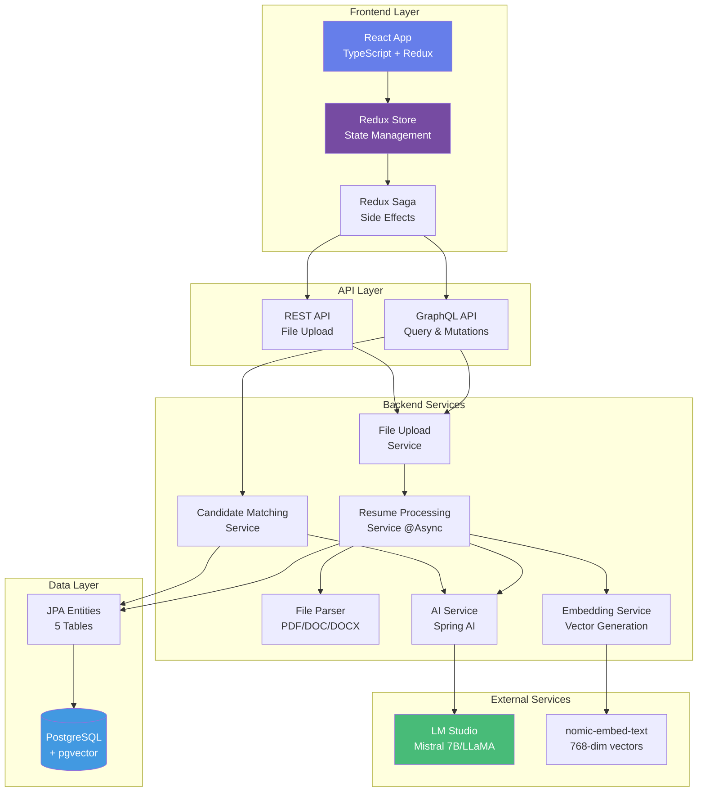

### Technology Stack

| Layer | Technologies |
|-------|-------------|
| **Frontend** | React 18, TypeScript, Redux Toolkit, Redux-Saga, Vite |
| **API** | GraphQL (Spring GraphQL), REST (Spring MVC) |
| **Backend** | Java 25, Spring Boot 3.2.2, Spring AI |
| **AI/ML** | LM Studio, Mistral 7B, nomic-embed-text |
| **Database** | PostgreSQL 15+, pgvector extension |
| **Build** | Maven, frontend-maven-plugin, Yarn |

---

## Data Flow

### User Journey Overview

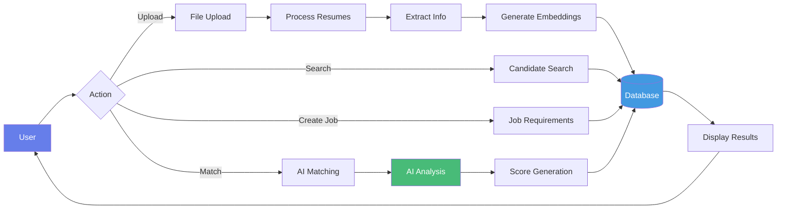

---

## Resume Processing Flow

### Detailed Sequence Diagram

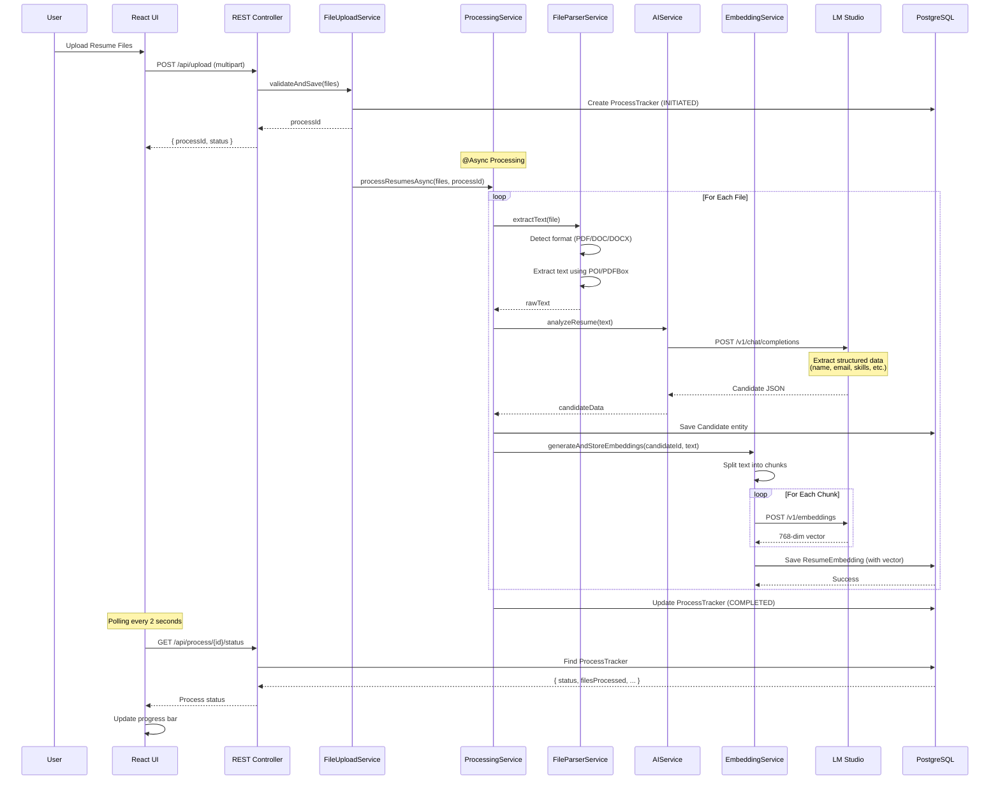

### Process States

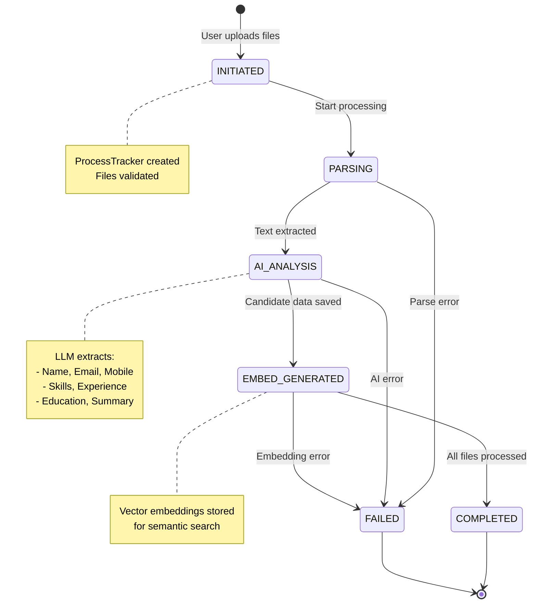

---

## Candidate Matching Flow

### AI-Powered Matching Sequence

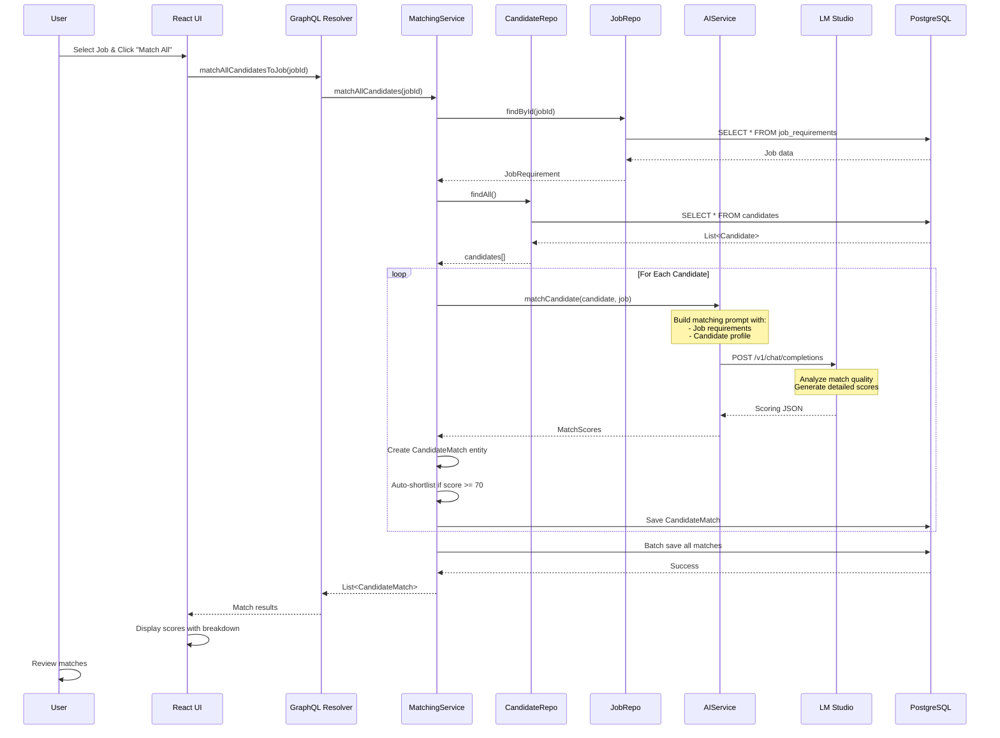

### Scoring Breakdown

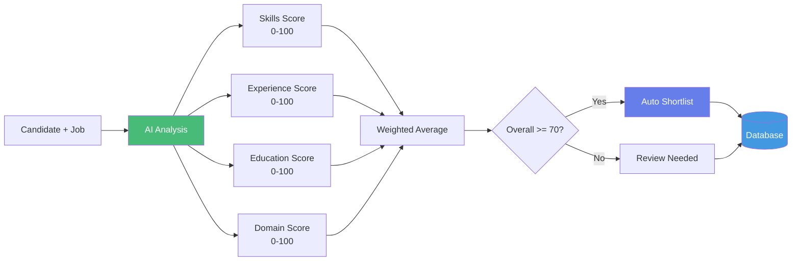

---

## Database Schema

### Entity Relationship Diagram

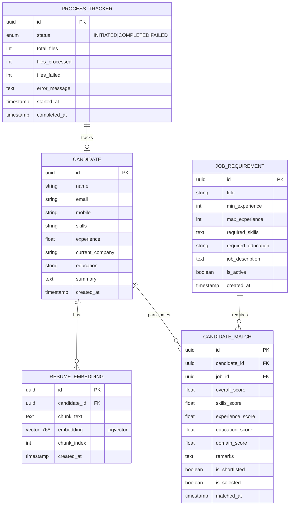

### Database Indexes & Constraints

| Table | Index/Constraint | Type | Purpose |
|-------|-----------------|------|---------|
| **candidate** | `idx_candidate_name` | B-tree | Fast name search |
| **candidate** | `idx_candidate_email` | Unique | Prevent duplicates |
| **resume_embedding** | `idx_embedding_candidate` | B-tree | Join optimization |
| **resume_embedding** | `idx_embedding_vector` | ivfflat | Vector similarity search |
| **candidate_match** | `idx_match_job` | B-tree | Filter by job |
| **candidate_match** | `idx_match_score` | B-tree | Sort by score |
| **candidate_match** | `idx_match_shortlist` | B-tree | Filter shortlisted |

---

## Frontend Architecture

### Component Hierarchy

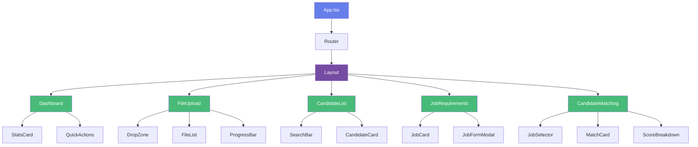

### Redux State Management

```mermaid
graph TB
    subgraph "Redux Store"
        A[Root Store]
        A --> B[candidatesSlice]
        A --> C[jobsSlice]
        A --> D[matchesSlice]
        A --> E[uploadSlice]
    end
    
    subgraph "State Shape"
        B --> B1[candidates: Candidate[]]
        B --> B2[loading: boolean]
        B --> B3[error: string]
        
        C --> C1[jobs: JobRequirement[]]
        C --> C2[selectedJob: Job]
        
        D --> D1[matches: CandidateMatch[]]
        D --> D2[matchingInProgress: boolean]
        
        E --> E1[tracker: ProcessTracker]
        E --> E2[uploading: boolean]
    end
    
    subgraph "Sagas (Side Effects)"
        F[Root Saga] --> G[fetchCandidatesSaga]
        F --> H[uploadFilesSaga]
        F --> I[matchCandidatesSaga]
        F --> J[createJobSaga]
    end
    
    G -.->|dispatch success| B
    H -.->|dispatch success| E
    I -.->|dispatch success| D
    J -.->|dispatch success| C
    
    style A fill:#667eea,color:#fff
    style F fill:#764ba2,color:#fff
```

### Data Flow in Frontend

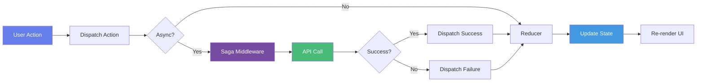

---

## API Communication

### GraphQL Schema Overview

```mermaid
graph TB
    subgraph "Queries"
        Q1[candidate id]
        Q2[allCandidates]
        Q3[searchCandidatesByName name]
        Q4[searchCandidatesBySkill skill]
        Q5[allJobs]
        Q6[activeJobs]
        Q7[matchesForJob jobId limit]
        Q8[processStatus id]
    end
    
    subgraph "Mutations"
        M1[updateCandidate id input]
        M2[deleteCandidate id]
        M3[createJobRequirement input]
        M4[updateJobRequirement id input]
        M5[deleteJobRequirement id]
        M6[matchCandidateToJob candidateId jobId]
        M7[matchAllCandidatesToJob jobId]
        M8[updateMatchStatus matchId input]
    end
    
    subgraph "Types"
        T1[Candidate]
        T2[JobRequirement]
        T3[CandidateMatch]
        T4[ProcessTracker]
    end
    
    Q1 --> T1
    Q2 --> T1
    Q3 --> T1
    Q4 --> T1
    Q5 --> T2
    Q6 --> T2
    Q7 --> T3
    Q8 --> T4
    
    M1 --> T1
    M3 --> T2
    M4 --> T2
    M6 --> T3
    M7 --> T3
    M8 --> T3
    
    style Q1 fill:#48bb78,color:#fff
    style Q2 fill:#48bb78,color:#fff
    style M1 fill:#f6ad55,color:#fff
    style M3 fill:#f6ad55,color:#fff
```

### REST Endpoints

| Method | Endpoint | Purpose | Request | Response |
|--------|----------|---------|---------|----------|
| **POST** | `/api/upload` | Upload resume files | `multipart/form-data` | `{ processId, status }` |
| **GET** | `/api/process/{id}/status` | Get processing status | - | `ProcessTracker` |

### API Call Flow

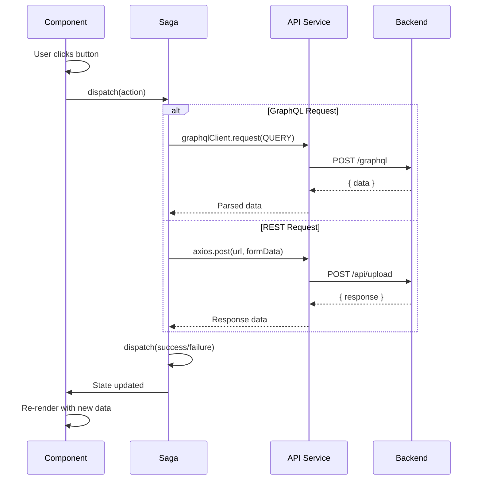

---

## Deployment Architecture

### Recommended Production Setup

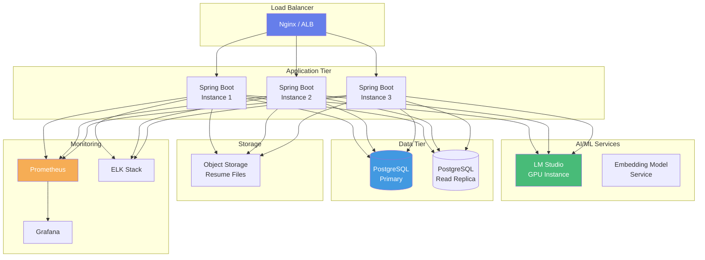

---

## Performance Considerations

### Optimization Strategies

1. **Database Optimization**
   - Connection pooling (HikariCP)
   - Query result caching
   - Batch inserts for embeddings
   - pgvector index tuning (ivfflat)

2. **Async Processing**
   - Resume processing runs asynchronously
   - Thread pool sizing: `@Async(TaskExecutor)`
   - Progress tracking via polling

3. **Frontend Optimization**
   - Code splitting with React.lazy()
   - Redux selector memoization
   - Debounced search inputs
   - Virtualized lists for large datasets

4. **AI Model Optimization**
   - Batched embedding generation
   - Model response caching
   - GPU acceleration for LLM
   - Text chunking optimization

### Scalability Diagram

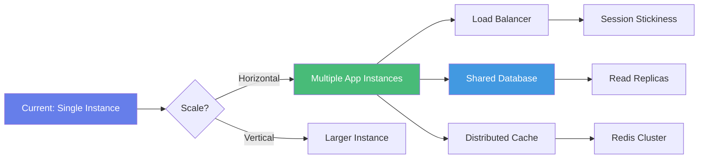

---

## Security Architecture

### Security Layers

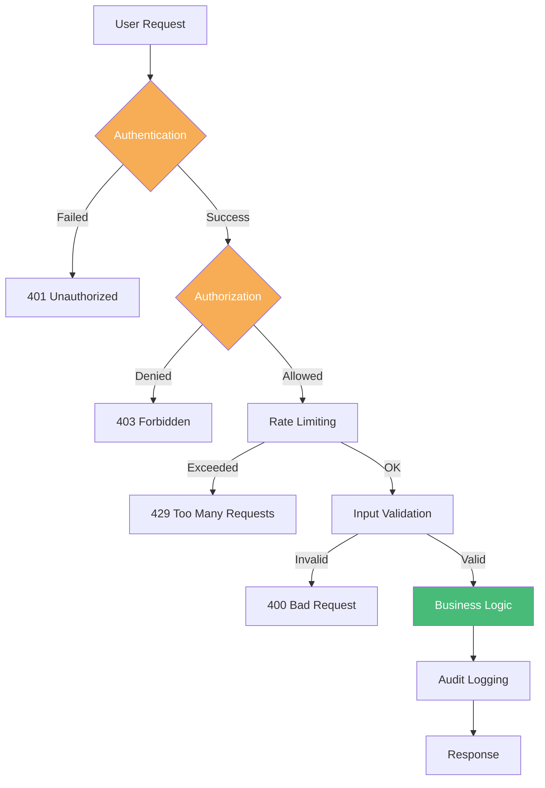

### Recommended Security Measures

1. **Authentication & Authorization** (Future)
   - JWT tokens for API authentication
   - Role-based access control (RBAC)
   - OAuth2/OIDC integration

2. **Data Protection**
   - Encrypt sensitive candidate data
   - HTTPS/TLS for all connections
   - Secure file storage

3. **API Security**
   - Rate limiting per user/IP
   - CORS configuration
   - GraphQL query complexity limits
   - File upload validation

4. **Infrastructure**
   - Network segmentation
   - Firewall rules
   - Regular security patches
   - Secrets management (Vault)

---

## Summary

This Resume Analyzer application follows a modern, scalable architecture:

✅ **Microservices-ready** - Clear service boundaries  
✅ **AI-powered** - Local LLM integration via Spring AI  
✅ **Vector Search** - Semantic resume matching with pgvector  
✅ **Async Processing** - Non-blocking resume analysis  
✅ **Type-safe** - Full TypeScript frontend  
✅ **State Management** - Redux with Saga for side effects  
✅ **GraphQL API** - Efficient data fetching  
✅ **Production-ready** - Monitoring, logging, error handling  

### Key Design Decisions

| Decision | Rationale |
|----------|-----------|
| **Spring AI over LangChain4J** | Better Spring Boot integration, simpler config |
| **GraphQL + REST** | GraphQL for queries, REST for file uploads |
| **Redux Saga** | Better control over async flows, testability |
| **pgvector** | Native PostgreSQL extension, no external service |
| **Local LLM** | Privacy, cost control, offline capability |
| **Async Processing** | Better UX, non-blocking operations |

---

**Document Version:** 1.0  
**Last Updated:** February 15, 2026  
**Maintained By:** Development Team
