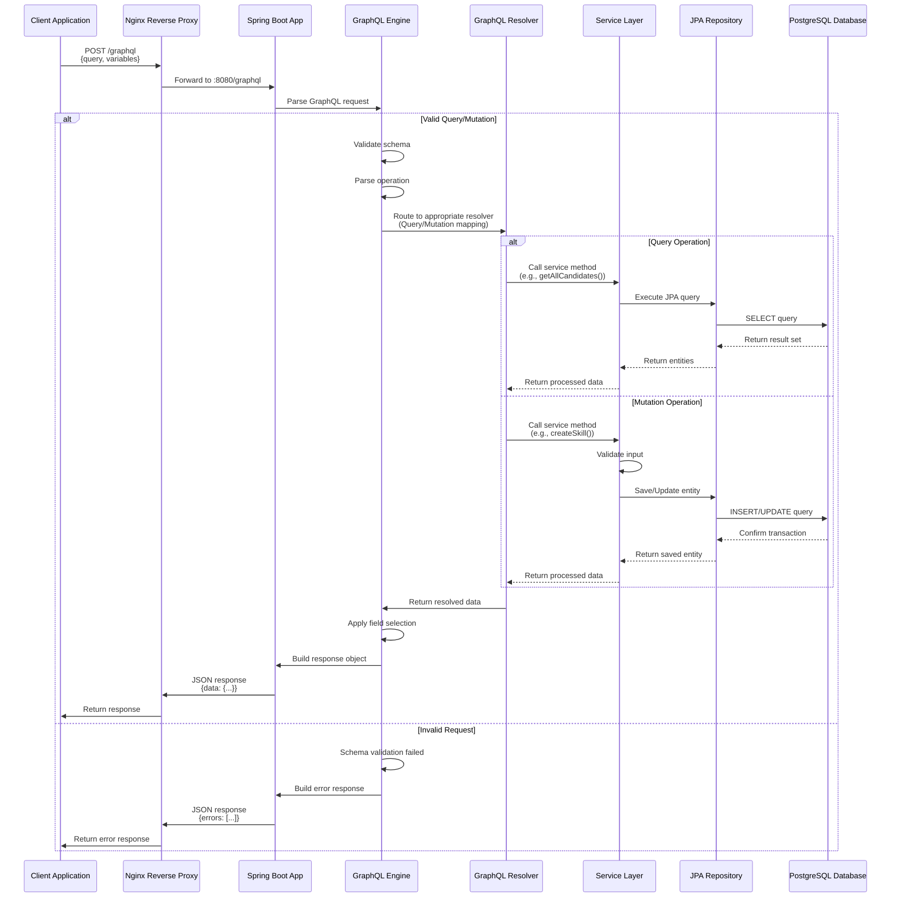

# GraphQL API Documentation

## Overview

The Resume Analyzer uses GraphQL as its primary API for querying and mutating data. This document explains the request/response model, query structure, and provides examples for all available operations.

## Request Processing Flow

The following sequence diagram illustrates how GraphQL requests are processed in the Resume Analyzer application:



### Key Components

1. **Client Application**: React frontend or any GraphQL client making requests
2. **Nginx Reverse Proxy**: Routes HTTPS requests to backend (production only)
3. **Spring Boot App**: Handles HTTP requests at `/graphql` endpoint
4. **GraphQL Engine**: Spring GraphQL library that parses and validates queries
5. **GraphQL Resolver**: Controller classes annotated with `@QueryMapping` or `@MutationMapping`
6. **Service Layer**: Business logic layer that processes operations
7. **JPA Repository**: Spring Data repositories for database access
8. **PostgreSQL Database**: Persistent data storage with pgvector extension

### Request Flow Details

- **Parsing**: GraphQL engine parses the query string and validates against schema
- **Validation**: Checks field existence, type compatibility, and argument requirements
- **Routing**: Maps operation to appropriate resolver method based on `@QueryMapping` or `@MutationMapping`
- **Execution**: Resolver calls service layer to execute business logic
- **Data Access**: Service uses JPA repositories to interact with database
- **Field Selection**: GraphQL engine applies field selection to return only requested fields
- **Response Building**: Constructs JSON response with `data` object or `errors` array

## GraphQL Endpoint

**URL**: `https://localhost/graphql` (Production) or `http://localhost:8080/graphql` (Development)  
**Method**: POST  
**Content-Type**: `application/json`

## Request Model

### Basic Request Structure

All GraphQL requests follow this structure:

```json
{
  "query": "query or mutation string",
  "variables": {
    "variable1": "value1",
    "variable2": "value2"
  },
  "operationName": "OptionalOperationName"
}
```

### Query Example

```json
{
  "query": "query GetCandidate($id: UUID!) { candidate(id: $id) { id name email mobile skills } }",
  "variables": {
    "id": "123e4567-e89b-12d3-a456-426614174000"
  }
}
```

### Mutation Example

```json
{
  "query": "mutation CreateSkill($name: String!, $category: String) { createSkill(name: $name, category: $category) { id name category isActive } }",
  "variables": {
    "name": "Spring Boot",
    "category": "Frameworks"
  }
}
```

## Response Model

### Successful Response

```json
{
  "data": {
    "candidate": {
      "id": "123e4567-e89b-12d3-a456-426614174000",
      "name": "John Doe",
      "email": "john@example.com",
      "mobile": "+1234567890",
      "skills": "Java, Spring Boot, React"
    }
  }
}
```

### Error Response

```json
{
  "errors": [
    {
      "message": "Candidate not found with id: 123e4567-e89b-12d3-a456-426614174000",
      "locations": [
        {
          "line": 1,
          "column": 8
        }
      ],
      "path": ["candidate"],
      "extensions": {
        "classification": "NOT_FOUND"
      }
    }
  ],
  "data": null
}
```

## Schema Types

### Scalar Types

- **UUID**: Universally Unique Identifier (e.g., `123e4567-e89b-12d3-a456-426614174000`)
- **LocalDateTime**: ISO-8601 date-time string (e.g., `2026-02-16T15:30:00`)
- **Upload**: Multipart file upload type
- **String**: Text data
- **Int**: Integer number
- **Float**: Floating-point number
- **Boolean**: true or false

### Enums

#### ProcessStatus
```graphql
enum ProcessStatus {
  INITIATED
  EMBED_GENERATED
  VECTOR_DB_UPDATED
  RESUME_ANALYZED
  COMPLETED
  FAILED
}
```

## Data Types

### Skill

```graphql
type Skill {
  id: UUID!
  name: String!
  category: String
  description: String
  isActive: Boolean!
  createdAt: LocalDateTime!
  updatedAt: LocalDateTime!
}
```

### Candidate

```graphql
type Candidate {
  id: UUID!
  name: String!
  email: String
  mobile: String
  resumeFilename: String
  experienceSummary: String
  skills: String
  domainKnowledge: String
  academicBackground: String
  yearsOfExperience: Int
  createdAt: LocalDateTime!
  updatedAt: LocalDateTime!
  matches: [CandidateMatch!]
}
```

### JobRequirement

```graphql
type JobRequirement {
  id: UUID!
  title: String!
  description: String
  requiredSkills: String
  skills: [Skill!]
  minExperienceYears: Int
  maxExperienceYears: Int
  requiredEducation: String
  domainRequirements: String
  location: String
  isActive: Boolean!
  createdAt: LocalDateTime!
  updatedAt: LocalDateTime!
  matches: [CandidateMatch!]
}
```

### CandidateMatch

```graphql
type CandidateMatch {
  id: UUID!
  candidate: Candidate!
  jobRequirement: JobRequirement!
  matchScore: Float
  skillsScore: Float
  experienceScore: Float
  educationScore: Float
  domainScore: Float
  matchExplanation: String
  isSelected: Boolean!
  isShortlisted: Boolean!
  recruiterNotes: String
  createdAt: LocalDateTime!
}
```

### ProcessTracker

```graphql
type ProcessTracker {
  id: UUID!
  status: ProcessStatus!
  totalFiles: Int
  processedFiles: Int
  failedFiles: Int
  message: String
  uploadedFilename: String
  createdAt: LocalDateTime!
  updatedAt: LocalDateTime!
  completedAt: LocalDateTime
}
```

## Queries

### Candidate Queries

#### Get All Candidates

```graphql
query {
  allCandidates {
    id
    name
    email
    skills
    yearsOfExperience
  }
}
```

**Response:**
```json
{
  "data": {
    "allCandidates": [
      {
        "id": "123e4567-e89b-12d3-a456-426614174000",
        "name": "John Doe",
        "email": "john@example.com",
        "skills": "Java, Spring Boot, React",
        "yearsOfExperience": 5
      }
    ]
  }
}
```

#### Search Candidates by Name

```graphql
query SearchByName($name: String!) {
  searchCandidatesByName(name: $name) {
    id
    name
    email
    mobile
  }
}
```

**Variables:**
```json
{
  "name": "John"
}
```

#### Search Candidates by Skill

```graphql
query SearchBySkill($skill: String!) {
  searchCandidatesBySkill(skill: $skill) {
    id
    name
    skills
    yearsOfExperience
  }
}
```

#### Filter by Experience Range

```graphql
query FilterByExperience($minYears: Int!, $maxYears: Int!) {
  candidatesByExperienceRange(minYears: $minYears, maxYears: $maxYears) {
    id
    name
    yearsOfExperience
  }
}
```

**Variables:**
```json
{
  "minYears": 3,
  "maxYears": 7
}
```

### Skills Queries

#### Get All Skills

```graphql
query {
  allSkills {
    id
    name
    category
    description
    isActive
    createdAt
  }
}
```

#### Get Active Skills Only

```graphql
query {
  activeSkills {
    id
    name
    category
  }
}
```

#### Search Skills (Auto-suggestion)

```graphql
query SearchSkills($name: String!) {
  searchSkills(name: $name) {
    id
    name
    category
  }
}
```

**Variables:**
```json
{
  "name": "Spring"
}
```

**Response:**
```json
{
  "data": {
    "searchSkills": [
      {
        "id": "456e4567-e89b-12d3-a456-426614174001",
        "name": "Spring Boot",
        "category": "Frameworks"
      },
      {
        "id": "456e4567-e89b-12d3-a456-426614174002",
        "name": "Spring Framework",
        "category": "Frameworks"
      }
    ]
  }
}
```

#### Get Skills by Category

```graphql
query GetByCategory($category: String!) {
  skillsByCategory(category: $category) {
    id
    name
    description
  }
}
```

**Variables:**
```json
{
  "category": "Frameworks"
}
```

#### Get All Skill Categories

```graphql
query {
  skillCategories
}
```

**Response:**
```json
{
  "data": {
    "skillCategories": [
      "Languages",
      "Frameworks",
      "Databases",
      "Cloud",
      "Tools"
    ]
  }
}
```

### Job Requirement Queries

#### Get All Job Requirements

```graphql
query {
  allJobRequirements {
    id
    title
    description
    minExperienceYears
    maxExperienceYears
    skills {
      id
      name
      category
    }
    isActive
  }
}
```

#### Get Active Jobs Only

```graphql
query {
  activeJobRequirements {
    id
    title
    location
    skills {
      name
    }
  }
}
```

#### Search Jobs by Title

```graphql
query SearchJobs($title: String!) {
  searchJobsByTitle(title: $title) {
    id
    title
    description
    location
  }
}
```

### Candidate Matching Queries

#### Get Matches for a Job

```graphql
query GetJobMatches($jobId: UUID!) {
  matchesForJob(jobRequirementId: $jobId) {
    id
    candidate {
      name
      email
      skills
    }
    matchScore
    skillsScore
    experienceScore
    matchExplanation
    isShortlisted
    isSelected
  }
}
```

#### Get Top Matches for a Job

```graphql
query GetTopMatches($jobId: UUID!, $limit: Int, $minScore: Float) {
  topMatchesForJob(jobRequirementId: $jobId, limit: $limit, minScore: $minScore) {
    candidate {
      name
      yearsOfExperience
    }
    matchScore
    matchExplanation
  }
}
```

**Variables:**
```json
{
  "jobId": "789e4567-e89b-12d3-a456-426614174003",
  "limit": 10,
  "minScore": 70.0
}
```

#### Get Matches for a Candidate

```graphql
query GetCandidateMatches($candidateId: UUID!) {
  matchesForCandidate(candidateId: $candidateId) {
    jobRequirement {
      title
      location
    }
    matchScore
    isSelected
  }
}
```

#### Get Selected Candidates for a Job

```graphql
query GetSelected($jobId: UUID!) {
  selectedCandidatesForJob(jobRequirementId: $jobId) {
    candidate {
      name
      email
      mobile
    }
    matchScore
    recruiterNotes
  }
}
```

#### Get Shortlisted Candidates

```graphql
query GetShortlisted($jobId: UUID!) {
  shortlistedCandidatesForJob(jobRequirementId: $jobId) {
    candidate {
      name
      skills
    }
    matchScore
  }
}
```

### Process Tracker Queries

#### Get Process Status

```graphql
query GetStatus($trackerId: UUID!) {
  processStatus(trackerId: $trackerId) {
    id
    status
    totalFiles
    processedFiles
    failedFiles
    message
    uploadedFilename
    createdAt
    updatedAt
    completedAt
  }
}
```

**Variables:**
```json
{
  "trackerId": "321e4567-e89b-12d3-a456-426614174004"
}
```

**Response:**
```json
{
  "data": {
    "processStatus": {
      "id": "321e4567-e89b-12d3-a456-426614174004",
      "status": "COMPLETED",
      "totalFiles": 5,
      "processedFiles": 5,
      "failedFiles": 0,
      "message": "Successfully processed all files",
      "uploadedFilename": "resumes.zip",
      "createdAt": "2026-02-16T10:30:00",
      "updatedAt": "2026-02-16T10:35:00",
      "completedAt": "2026-02-16T10:35:00"
    }
  }
}
```

#### Get Recent Process Trackers

```graphql
query GetRecentUploads($hours: Int!) {
  recentProcessTrackers(hours: $hours) {
    id
    status
    totalFiles
    processedFiles
    failedFiles
    uploadedFilename
    createdAt
    completedAt
  }
}
```

**Variables:**
```json
{
  "hours": 24
}
```

## Mutations

### Skills Mutations

#### Create Skill

```graphql
mutation CreateSkill($name: String!, $category: String, $description: String) {
  createSkill(name: $name, category: $category, description: $description) {
    id
    name
    category
    description
    isActive
    createdAt
  }
}
```

**Variables:**
```json
{
  "name": "Next.js",
  "category": "Frameworks",
  "description": "React framework for production"
}
```

#### Update Skill

```graphql
mutation UpdateSkill($id: UUID!, $name: String, $category: String, $description: String, $isActive: Boolean) {
  updateSkill(
    id: $id
    name: $name
    category: $category
    description: $description
    isActive: $isActive
  ) {
    id
    name
    category
    description
    isActive
    updatedAt
  }
}
```

**Variables:**
```json
{
  "id": "456e4567-e89b-12d3-a456-426614174001",
  "name": "Spring Boot 3",
  "isActive": true
}
```

#### Delete Skill

```graphql
mutation DeleteSkill($id: UUID!) {
  deleteSkill(id: $id)
}
```

**Variables:**
```json
{
  "id": "456e4567-e89b-12d3-a456-426614174001"
}
```

**Response:**
```json
{
  "data": {
    "deleteSkill": true
  }
}
```

### Job Requirement Mutations

#### Create Job Requirement

```graphql
mutation CreateJob(
  $title: String!
  $description: String
  $requiredSkills: String
  $skillIds: [UUID!]
  $minExperience: Int
  $maxExperience: Int
  $requiredEducation: String
  $domain: String
  $location: String
) {
  createJobRequirement(
    title: $title
    description: $description
    requiredSkills: $requiredSkills
    skillIds: $skillIds
    minExperience: $minExperience
    maxExperience: $maxExperience
    requiredEducation: $domain
    domain: $domain
    location: $location
  ) {
    id
    title
    skills {
      name
    }
    minExperienceYears
    maxExperienceYears
    location
    isActive
  }
}
```

**Variables:**
```json
{
  "title": "Senior Full Stack Developer",
  "description": "Looking for experienced full-stack developer",
  "requiredSkills": "Java, Spring Boot, React, PostgreSQL",
  "skillIds": [
    "456e4567-e89b-12d3-a456-426614174001",
    "456e4567-e89b-12d3-a456-426614174002"
  ],
  "minExperience": 5,
  "maxExperience": 10,
  "requiredEducation": "Bachelor's in Computer Science",
  "domain": "Enterprise Applications",
  "location": "Remote"
}
```

#### Update Job Requirement

```graphql
mutation UpdateJob($id: UUID!, $title: String, $skillIds: [UUID!], $isActive: Boolean) {
  updateJobRequirement(id: $id, title: $title, skillIds: $skillIds, isActive: $isActive) {
    id
    title
    skills {
      name
    }
    isActive
    updatedAt
  }
}
```

#### Deactivate Job Requirement

```graphql
mutation DeactivateJob($id: UUID!) {
  deactivateJobRequirement(id: $id) {
    id
    title
    isActive
  }
}
```

#### Delete Job Requirement

```graphql
mutation DeleteJob($id: UUID!) {
  deleteJobRequirement(id: $id)
}
```

### Candidate Matching Mutations

#### Match Candidate to Job

```graphql
mutation MatchOneToOne($candidateId: UUID!, $jobId: UUID!) {
  matchCandidateToJob(candidateId: $candidateId, jobRequirementId: $jobId) {
    id
    matchScore
    skillsScore
    experienceScore
    matchExplanation
  }
}
```

**Variables:**
```json
{
  "candidateId": "123e4567-e89b-12d3-a456-426614174000",
  "jobId": "789e4567-e89b-12d3-a456-426614174003"
}
```

#### Match All Candidates to a Job

```graphql
mutation MatchAllToJob($jobId: UUID!) {
  matchAllCandidatesToJob(jobRequirementId: $jobId) {
    id
    candidate {
      name
    }
    matchScore
  }
}
```

#### Match Candidate to All Jobs

```graphql
mutation MatchCandidateToAll($candidateId: UUID!) {
  matchCandidateToAllJobs(candidateId: $candidateId) {
    id
    jobRequirement {
      title
    }
    matchScore
  }
}
```

#### Update Candidate Match

```graphql
mutation UpdateMatch($matchId: UUID!, $input: UpdateCandidateMatchInput!) {
  updateCandidateMatch(matchId: $matchId, input: $input) {
    id
    isSelected
    isShortlisted
    recruiterNotes
  }
}
```

**Variables:**
```json
{
  "matchId": "654e4567-e89b-12d3-a456-426614174005",
  "input": {
    "isShortlisted": true,
    "recruiterNotes": "Strong technical background, good cultural fit"
  }
}
```

### Candidate Mutations

#### Delete Candidate

```graphql
mutation DeleteCandidate($id: UUID!) {
  deleteCandidate(id: $id)
}
```

## Using GraphQL from Frontend

### Using graphql-request (Recommended)

```typescript
import { GraphQLClient, gql } from 'graphql-request';

const client = new GraphQLClient('https://localhost/graphql');

// Query
const GET_SKILLS = gql`
  query GetActiveSkills {
    activeSkills {
      id
      name
      category
    }
  }
`;

const skills = await client.request(GET_SKILLS);

// Mutation with variables
const CREATE_SKILL = gql`
  mutation CreateSkill($name: String!, $category: String) {
    createSkill(name: $name, category: $category) {
      id
      name
    }
  }
`;

const newSkill = await client.request(CREATE_SKILL, {
  name: 'TypeScript',
  category: 'Languages'
});
```

### Using Fetch API

```typescript
const query = `
  query GetCandidate($id: UUID!) {
    candidate(id: $id) {
      name
      email
      skills
    }
  }
`;

const response = await fetch('https://localhost/graphql', {
  method: 'POST',
  headers: {
    'Content-Type': 'application/json',
  },
  body: JSON.stringify({
    query,
    variables: { id: '123e4567-e89b-12d3-a456-426614174000' }
  })
});

const { data, errors } = await response.json();
```

## Error Handling

### Common Error Types

1. **Validation Errors** - Invalid input data
```json
{
  "errors": [{
    "message": "Validation error: name cannot be empty",
    "extensions": { "classification": "VALIDATION_ERROR" }
  }]
}
```

2. **Not Found Errors** - Resource doesn't exist
```json
{
  "errors": [{
    "message": "Skill not found with id: 123...",
    "extensions": { "classification": "NOT_FOUND" }
  }]
}
```

3. **Authorization Errors** - Access denied
```json
{
  "errors": [{
    "message": "Unauthorized access",
    "extensions": { "classification": "UNAUTHORIZED" }
  }]
}
```

### Frontend Error Handling Pattern

```typescript
try {
  const data = await client.request(QUERY, variables);
  return data;
} catch (error) {
  if (error.response?.errors) {
    // GraphQL errors
    const message = error.response.errors[0].message;
    console.error('GraphQL Error:', message);
    alert(message);
  } else {
    // Network or other errors
    console.error('Network Error:', error);
    alert('Failed to connect to server');
  }
}
```

## Best Practices

### 1. Request Only Needed Fields

❌ **Bad:**
```graphql
query {
  allCandidates {
    id
    name
    email
    mobile
    resumeFilename
    experienceSummary
    skills
    domainKnowledge
    academicBackground
    yearsOfExperience
    createdAt
    updatedAt
    matches { ... }
  }
}
```

✅ **Good:**
```graphql
query {
  allCandidates {
    id
    name
    email
    yearsOfExperience
  }
}
```

### 2. Use Variables for Dynamic Values

❌ **Bad:**
```graphql
query {
  searchSkills(name: "Spring") {
    id
    name
  }
}
```

✅ **Good:**
```graphql
query SearchSkills($name: String!) {
  searchSkills(name: $name) {
    id
    name
  }
}
```

### 3. Name Your Operations

❌ **Bad:**
```graphql
query {
  allSkills { id name }
}
```

✅ **Good:**
```graphql
query GetAllSkills {
  allSkills {
    id
    name
  }
}
```

### 4. Handle Null Values

```typescript
const candidate = data.candidate;
const email = candidate?.email ?? 'No email provided';
const mobile = candidate?.mobile || 'N/A';
```

### 5. Batch Queries

```graphql
query GetDashboardData {
  allCandidates { id name }
  activeJobRequirements { id title }
  activeSkills { id name }
}
```

## GraphQL Playground

Access the interactive GraphQL playground at:
- **Development**: http://localhost:8080/graphiql
- **Production**: https://localhost/graphiql

The playground provides:
- Schema documentation
- Auto-completion
- Query validation
- Interactive query building

## Additional Resources

- **GraphQL Official Docs**: https://graphql.org/learn/
- **graphql-request**: https://github.com/jasonkuhrt/graphql-request
- **Spring GraphQL**: https://spring.io/projects/spring-graphql
