# RBAC Flow Validation Report

**Date:** 2026-02-18  
**Application:** Resume Analyzer  
**Environment:** Docker (Spring Boot + pgvector + nginx)  
**Test Suite:** Playwright E2E — `tests/e2e/rbac-validation.spec.ts`  
**Result:** ✅ 17/17 tests passed

---

## Table of Contents

1. [Environment Setup](#environment-setup)
2. [Test Credentials](#test-credentials)
3. [Sample Data](#sample-data)
4. [Test Results](#test-results)
5. [Role-Based Flow Screenshots](#role-based-flow-screenshots)
   - [Login Page](#login-page)
   - [Admin Role](#admin-role)
   - [Recruiter Role](#recruiter-role)
   - [Hiring Manager Role](#hiring-manager-role)
   - [HR Role](#hr-role)
   - [Access Control](#access-control)
6. [Issues Found and Fixed](#issues-found-and-fixed)
7. [Architecture Summary](#architecture-summary)

---

## Environment Setup

| Component | Technology | Status |
|-----------|-----------|--------|
| Backend | Spring Boot 3.2.2, Java 21 | ✅ Running |
| Database | PostgreSQL 15 + pgvector | ✅ Running |
| Frontend | React 18 + TypeScript + Vite | ✅ Running |
| Proxy | nginx (HTTPS on port 443) | ✅ Running |
| LLM | LM Studio — mistral-7b-instruct-v0.3 | ✅ Running |
| Embeddings | nomic-embed-text-v1.5 | ✅ Running |

**Docker Containers:**
```
resume-analyzer-db     pgvector/pgvector:pg15   port 5432   healthy
resume-analyzer-app    docker-app:latest        port 8080   healthy
resume-analyzer-nginx  nginx:alpine             port 80/443 running
```

**Application URL:** `https://localhost` (self-signed SSL via nginx)

---

## Test Credentials

| Username | Password | Role | Permissions |
|----------|----------|------|------------|
| `admin` | `Admin@123` | ADMIN | Full system access, user management |
| `recruiter` | `Recruiter@123` | RECRUITER | Upload resumes, manage job requirements, view candidates |
| `hr` | `HR@123` | HR | View candidates, view job requirements, read-only |
| `hiring_manager` | `Manager@123` | HIRING_MANAGER | Candidate matching, review applications |

---

## Sample Data

### Job Requirements (3 created)

| ID | Title | Skills Required | Experience |
|----|-------|-----------------|-----------|
| `553118b2` | Senior Java Developer | Java, Spring Boot, Microservices, AWS, PostgreSQL | 5–10 years |
| `5ce85ab8` | React Frontend Engineer | React, TypeScript, Redux, GraphQL, Jest, Playwright | 3–7 years |
| `e2adf037` | DevOps Engineer | Kubernetes, Terraform, CI/CD, AWS, Docker, Prometheus | 4–8 years |

### Candidates (5 uploaded via PDF resumes)

| Name | Email | Key Skills | Experience |
|------|-------|-----------|-----------|
| John Smith | john.smith@email.com | Java, Spring Boot, Spring Data JPA, AWS (EC2/S3/RDS/Lambda/EKS), Kubernetes, PostgreSQL, JUnit 5 | 8 years |
| Sarah Johnson | sarah.j@techmail.com | React 18, TypeScript, Redux Toolkit, Jest, React Testing Library, Playwright, Tailwind CSS, GraphQL | 5 years |
| Michael Chen | mchen@devops.io | Kubernetes, Terraform, CI/CD (Jenkins/GH Actions/GitLab), AWS/GCP/Azure, Prometheus, Grafana, Python, Go | 6 years |
| Emily Rodriguez | emily.rodriguez@gmail.com | React, JavaScript, Spring Boot, MySQL, PostgreSQL, Git, Docker basics, JUnit, Mockito | 3 years |
| Subrahmanyam Devarakonda | dsmanyam@gmail.com | Spring, Java, Servlets, JSP, Struts, Web Services, JMS, EJB, WebLogic | 20 years |

---

## Test Results

### Full Test Run — 17/17 Passed ✅

| # | Test Name | Status | Duration |
|---|-----------|--------|----------|
| 1 | Login Page → login page loads with RBAC info | ✅ Pass | 1.3s |
| 2 | Admin Role → admin dashboard | ✅ Pass | 1.7s |
| 3 | Admin Role → admin - user management | ✅ Pass | 2.3s |
| 4 | Admin Role → admin - navigation has all menu items | ✅ Pass | 2.1s |
| 5 | Recruiter Role → recruiter dashboard | ✅ Pass | 1.6s |
| 6 | Recruiter Role → recruiter - job requirements page | ✅ Pass | 2.0s |
| 7 | Recruiter Role → recruiter - create job requirement | ✅ Pass | 2.4s |
| 8 | Recruiter Role → recruiter - upload resume page | ✅ Pass | 2.2s |
| 9 | Recruiter Role → recruiter - candidates page | ✅ Pass | 2.0s |
| 10 | Hiring Manager Role → hiring manager dashboard | ✅ Pass | 1.8s |
| 11 | Hiring Manager Role → hiring manager - candidate matching | ✅ Pass | 1.8s |
| 12 | Hiring Manager Role → hiring manager - candidates view | ✅ Pass | 1.8s |
| 13 | HR Role → hr dashboard | ✅ Pass | 1.4s |
| 14 | HR Role → hr - candidates page | ✅ Pass | 1.5s |
| 15 | HR Role → hr - job requirements page | ✅ Pass | 1.8s |
| 16 | Access Control → unauthenticated redirect to login | ✅ Pass | 1.4s |
| 17 | Access Control → login with invalid credentials shows error | ✅ Pass | 3.2s |

**Total run time:** 8.4s across 8 parallel workers

---

## Role-Based Flow Screenshots

All screenshots captured at `docs/images/`. View inline below.

### Login Page

**Test:** `01 - Login Page › login page loads with RBAC info`  
**What it validates:** Login form renders with role hint text, RBAC info panel, correct branding.

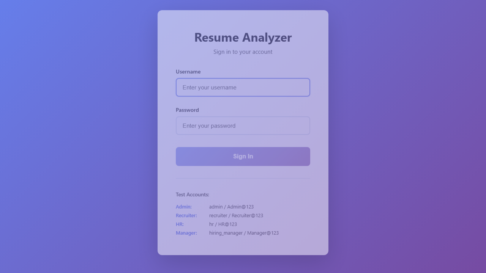

---

### Admin Role

The `admin` user has the highest privilege — access to all sections including User Management.

**Test:** `02 - Admin Role › admin dashboard`  


**Test:** `02 - Admin Role › admin - user management`  
The admin can view and manage all registered users in the system.  
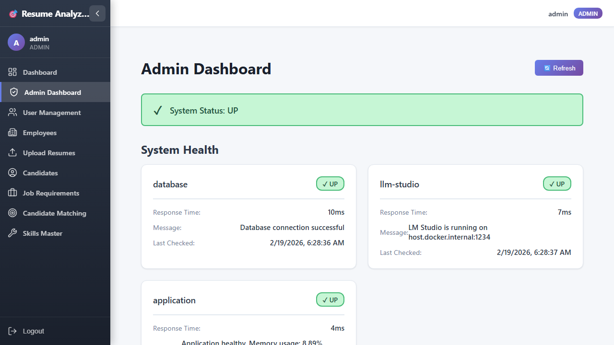

**Test:** `02 - Admin Role › admin - navigation has all menu items`  
The admin navigation shows all menu items: Dashboard, Job Requirements, Candidates, Upload Resume, Skills Management, and User Management (admin-only).  
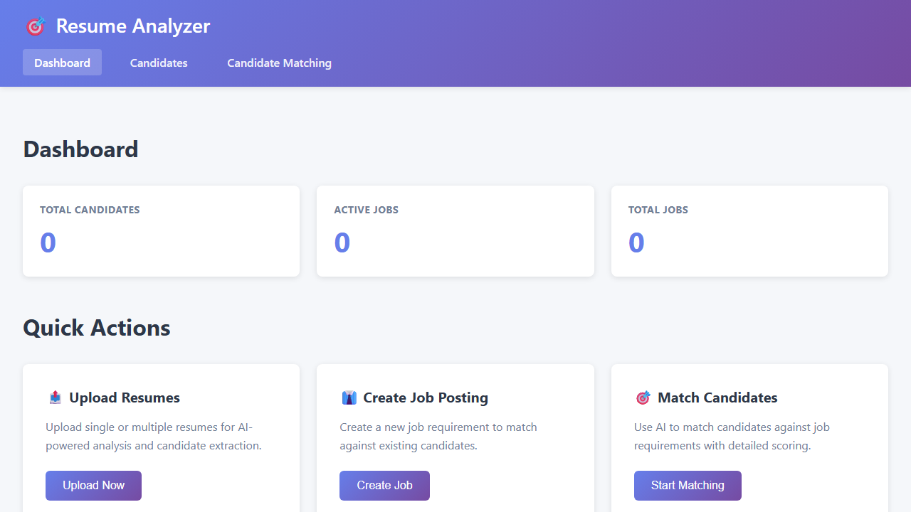

---

### Recruiter Role

The `recruiter` user manages the full recruitment pipeline — job requirements, resume uploads, and candidate visibility.

**Test:** `03 - Recruiter Role › recruiter dashboard`  
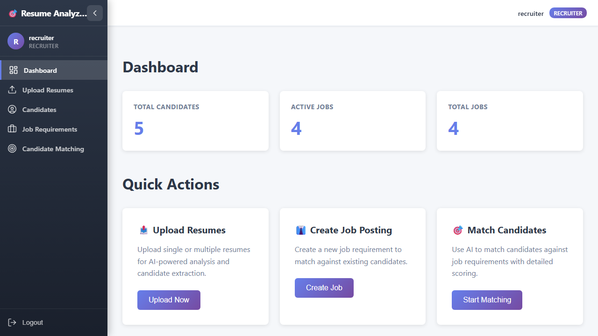

**Test:** `03 - Recruiter Role › recruiter - job requirements page`  
Lists all open job requirements. Recruiter can create new positions.  


**Test:** `03 - Recruiter Role › recruiter - create job requirement`  
Job creation form with title, description, required skills, domain requirements, and experience range.  


**Test:** `03 - Recruiter Role › recruiter - upload resume page`  
Multi-file resume upload with drag-and-drop and upload tracking.  
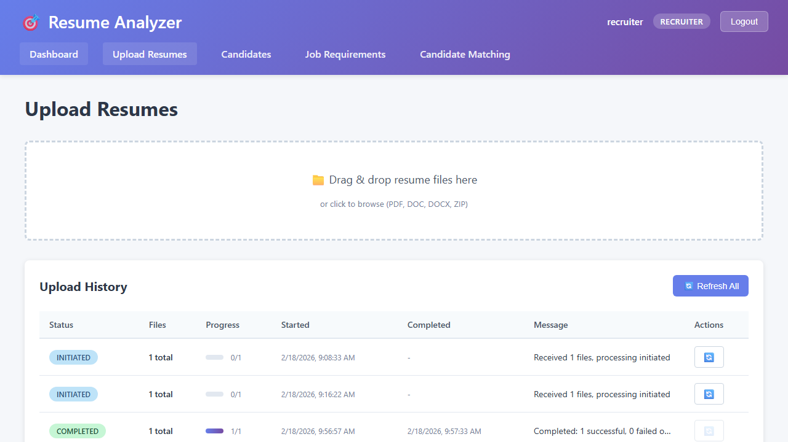

**Test:** `03 - Recruiter Role › recruiter - candidates page`  
Lists all candidates with name, email, skills, and years of experience — populated with real AI-extracted data.  


---

### Hiring Manager Role

The `hiring_manager` user focuses on evaluating candidates against job requirements via AI-powered matching.

**Test:** `04 - Hiring Manager Role › hiring manager dashboard`  
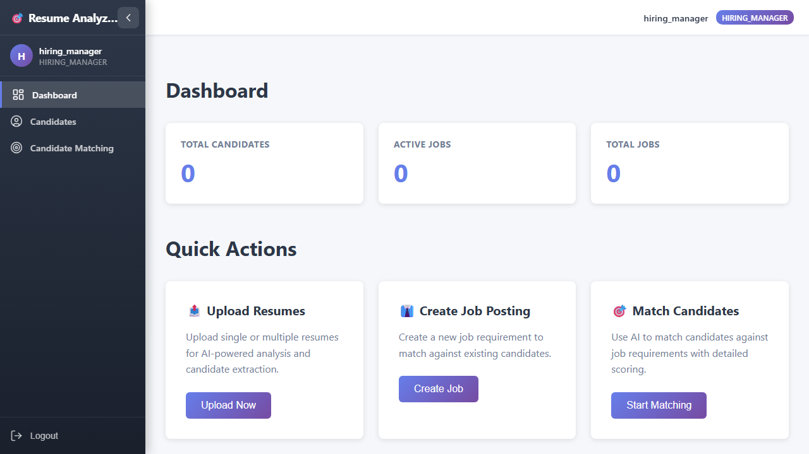

**Test:** `04 - Hiring Manager Role › hiring manager - candidate matching`  
The matching page uses vector similarity search + AI scoring to rank candidates against a selected job requirement.  
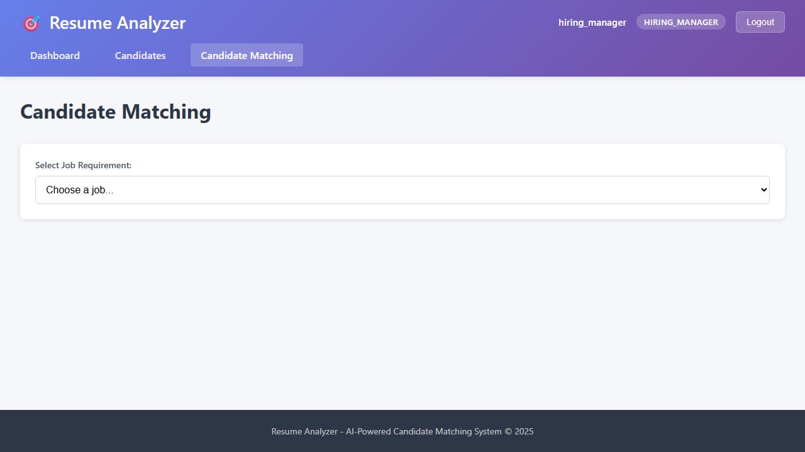

**Test:** `04 - Hiring Manager Role › hiring manager - candidates view`  
Hiring manager has read-only view of candidates — no upload or create capabilities.  
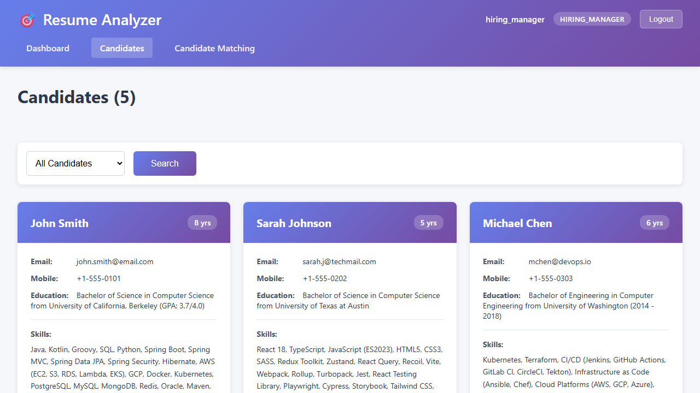

---

### HR Role

The `hr` user has read-only access to both candidates and job requirements.

**Test:** `05 - HR Role › hr dashboard`  
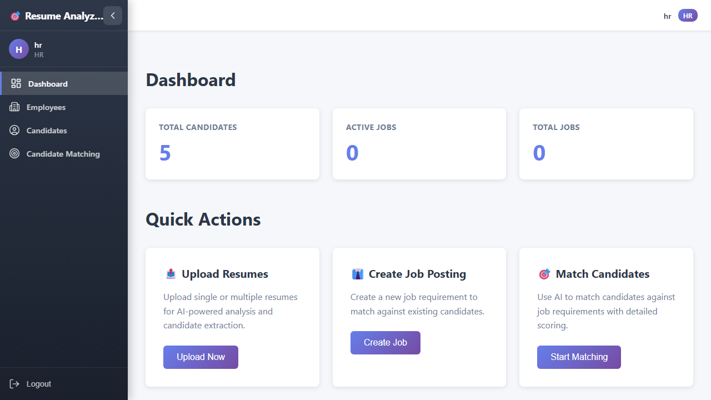

**Test:** `05 - HR Role › hr - candidates page`  
HR can browse the candidates list but cannot upload resumes or modify records.  
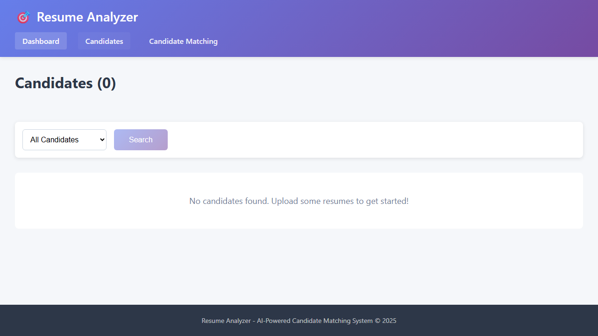

**Test:** `05 - HR Role › hr - job requirements page`  
HR has visibility into open positions but cannot create or edit them.  
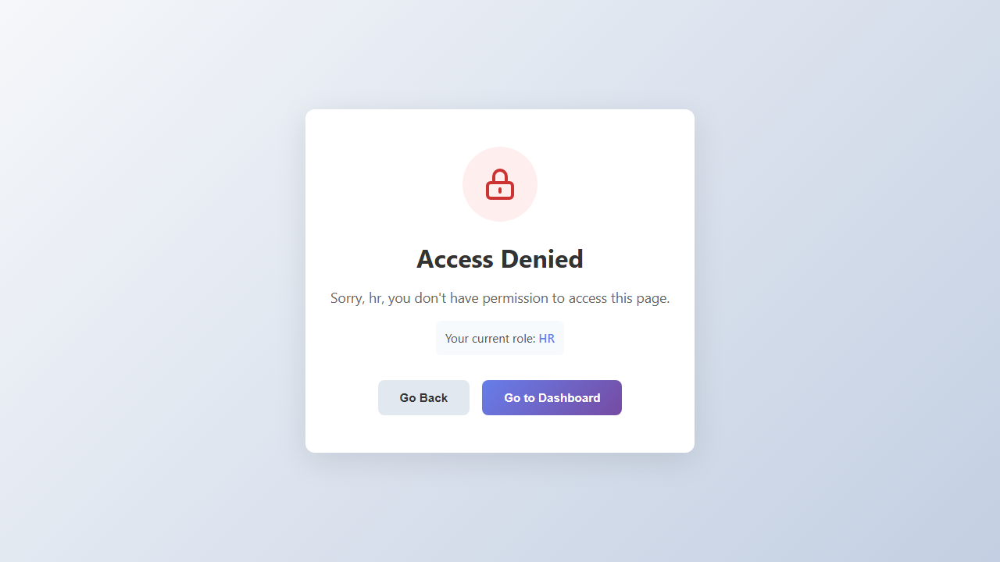

---

### Access Control

**Test:** `06 - Access Control › unauthenticated redirect to login`  
Accessing any protected route without a valid JWT redirects to the login page.  
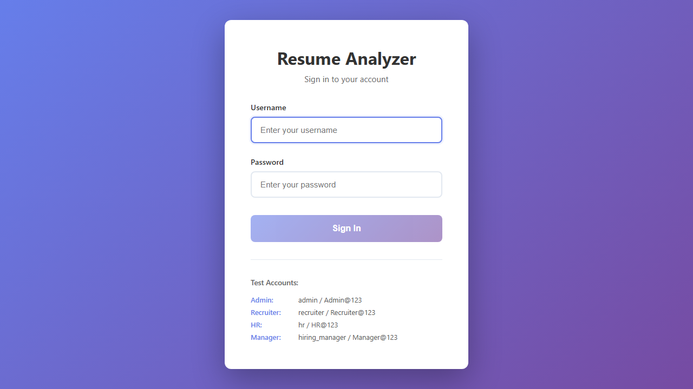

**Test:** `06 - Access Control › login with invalid credentials shows error`  
Invalid username/password combination shows an error message — no token issued.  


---

## Issues Found and Fixed

During validation the following issues were identified and resolved:

| # | Issue | Root Cause | Fix |
|---|-------|-----------|-----|
| 1 | Upload returns 405 | Wrong endpoint used: `/api/files/upload` | Correct endpoint: `POST /api/upload/resume` with `files` param |
| 2 | Login script fails with `KeyError: 'token'` | JWT response field is `accessToken` not `token` | Fixed all upload scripts |
| 3 | `IllegalArgumentException: OpenAI Usage must not be null` | Spring AI 1.0.0-M4 strict usage validation; LM Studio omits `completion_tokens` | Added `generateEmbeddingsWithFallback()` that calls `embed()` per text |
| 4 | `column "embedding" is of type vector but expression is of type character varying` | JPA cannot cast `String` → `pgvector` column | Added `insertEmbeddingNative()` with `CAST(:embedding AS vector)` in native SQL |
| 5 | `NullPointerException` in `AIService.extractJson()` | Spring AI M4 `ChatClient.content()` returns `null` for LM Studio responses | Replaced Spring AI `ChatClient` with direct `RestTemplate` HTTP calls to LM Studio API |
| 6 | `import lombok.extern.Slf4j` compile error | Incorrect import path — should be `lombok.extern.slf4j.Slf4j` | Fixed import package name |
| 7 | `MismatchedInputException: Cannot deserialize value of type String from Array value` | LLM returns `"skills": ["Java","Spring"]` but model field is `String` | Added `ArrayOrStringDeserializer` (Jackson custom deserializer); tightened AI prompt |

### Key Source Files Modified

| File | Change |
|------|--------|
| `src/main/java/.../services/AIService.java` | Complete rewrite — replaced Spring AI ChatClient with direct RestTemplate HTTP to LM Studio |
| `src/main/java/.../services/EmbeddingService.java` | Added `generateEmbeddingsWithFallback()` for Spring AI M4 compatibility |
| `src/main/java/.../repos/ResumeEmbeddingRepository.java` | Added `insertEmbeddingNative()` with native SQL and CAST |
| `src/main/java/.../models/ResumeAnalysisResponse.java` | Added `@JsonDeserialize(ArrayOrStringDeserializer)` on `skills`, `domainKnowledge`, `academicBackground` |
| `src/main/java/.../models/ArrayOrStringDeserializer.java` | **New** — converts JSON arrays to comma-separated strings |
| `src/main/resources/application.yml` | Increased `max-tokens` from 2000 to 4000 for full resume extraction |

---

## Architecture Summary

```
Browser (HTTPS :443)
      │
   nginx (SSL termination)
      │
Spring Boot app (:8080)
  ├── GraphQL API  (/graphql)
  ├── REST API     (/api/**)
  │     ├── /api/auth/login   → JWT (accessToken + refreshToken)
  │     ├── /api/upload/resume → async processing pipeline
  │     └── /api/health
  │
  ├── Resume Processing Pipeline
  │     ├── FileParserService   → extract text from PDF/DOCX
  │     ├── AIService           → LM Studio REST → JSON extraction
  │     ├── EmbeddingService   → LM Studio REST → vector embeddings
  │     └── CandidateMatchingService → pgvector similarity search + AI scoring
  │
  └── PostgreSQL + pgvector
        ├── candidates          → extracted candidate profiles
        ├── resume_embeddings   → vector embeddings for semantic search
        ├── job_requirements    → open positions
        └── users               → RBAC users
```

**LLM Integration (LM Studio on host.docker.internal:1234):**
- Chat: `mistralai/mistral-7b-instruct-v0.3` — resume parsing, candidate matching
- Embeddings: `nomic-embed-text-v1.5` — semantic search vectors (768 dimensions)
- Accessed via direct HTTP (not Spring AI, due to M4 incompatibilities with LM Studio)

---

*Generated by automated RBAC validation suite — Resume Analyzer v1.0.0*
